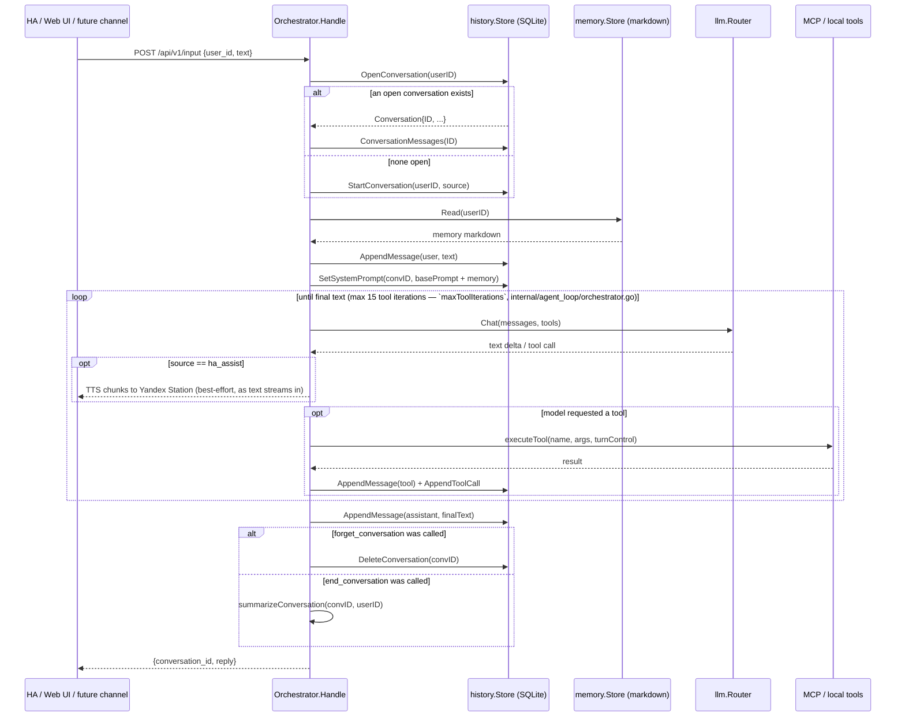
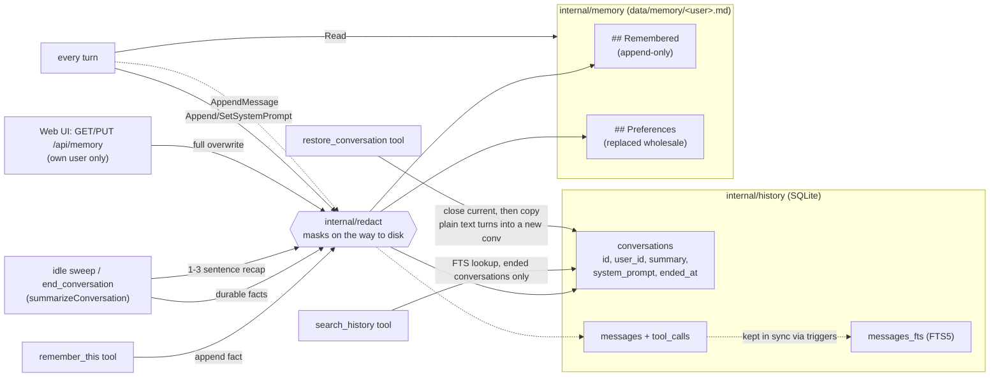

# Miranda — project notes for Claude Code

Miranda is a standalone Go Agent Service — a full personal assistant for
home and family (smart home control, diary/notes/reminders, nutrition
tracking, open-ended tasks, general conversation), not just a Home
Assistant voice add-on — see `README.md` for architecture, build/test
commands, and the HA integration.

## Environment facts

- **Sibling repos checked out locally**: `../miranda-llm` (the `llmtrace`
  package referenced throughout this doc — router/tracer logic lives there,
  not in this repo), `../miranda-medical-card` (referenced under Logging for
  its own `llm-trace` debugging workflow), `../miranda-diary`,
  `../miranda-code-execution-sandbox`, `../miranda-yazio` (the MCP servers
  listed in `README.md`). When a reference elsewhere in this file names one
  of these by path, it means "look in that sibling directory," not
  somewhere inside this repo.
- **Home Assistant version: 2026.7.2.** Always check API/integration
  documentation and behavior against this version specifically — HA's
  conversation entity platform, MCP Server integration, and other APIs
  referenced here evolve quickly between versions.
- **Yandex Station integration**: we use
  [AlexxIT/YandexStation](https://github.com/AlexxIT/YandexStation) as the
  HA custom_component that exposes Yandex Stations as `media_player`
  entities. Miranda TTS uses `media_player.play_media` with
  `media_content_type: text` (never `dialog` — that reopens the station's
  own mic). The opt-in `gemini_tts` provider uses `media_content_type: music`
  with a URL — **not yet verified on real hardware**. When touching
  TTS/media_player code, check against this specific integration, not HA's
  generic `media_player` or other Yandex integrations.

## Conventions

- Write explanatory comments (doc-comments on exported symbols, comments on
  non-obvious logic) — this project intentionally diverges from a
  terse/no-comments default; see repo history for why.
- No Docker, no cgo. Single static Go binary (`CGO_ENABLED=0`), pure-Go
  SQLite (`modernc.org/sqlite`). Keep new dependencies cgo-free **and
  permissively licensed** — today every one is Apache-2.0/MIT/ISC. Miranda
  itself ships under the PolyForm Noncommercial License 1.0.0 (see
  `LICENSE`), which is a restriction Miranda's own copyright holder is free
  to impose; pulling in a copyleft dependency (GPL/AGPL/LGPL/MPL) would
  impose terms *on* Miranda instead, so check a new module's license before
  adding it.
- Config: every field has a Go-level default in `internal/config.Default()`;
  `config.yaml` only needs to override what differs.

## Architecture: agent loop, sessions, and memory

Two independent stores back everything conversation- and memory-related:

| Aspect | `internal/history` (SQLite) | `internal/memory` (markdown) |
|---|---|---|
| Holds | Raw dialog log: every message, tool call, per-conversation recap/system-prompt snapshot | Distilled, durable facts about a user that persist across every conversation |
| Granularity | Per conversation | One file per user (`data/memory/<user_id>.md`) |
| Written by | `AppendMessage`/`AppendToolCall` every turn; `EndConversationWithSummary` on session close | `remember_this` tool (append); summarization pass (replace `## Preferences`); web UI editor (full overwrite) |
| Read by | `search_history` tool (past, ended conversations only); web UI dialog browser (own conversations only) | Every turn, injected into the system prompt |

Both are written through `internal/redact` — see **Redaction** below. Neither
holds a raw pin code or password, even though the model saw one.

### Session ownership

Session continuity is **server-owned, keyed only on user identity** —
`InputRequest.ConversationID` is accepted for backward-compatible request
shape but never read. The same user on any channel (HA, web UI, Telegram,
future mobile) always continues the same open conversation, because
`resolveConversation` looks it up via `history.OpenConversation(userID)`.
Only the idle timeout (`Memory.SessionIdleTimeoutMinutes`, default 25) and
the explicit `end_conversation`/`forget_conversation` tools ever close a
session.

Destructive actions (`DeleteConversation`, ending+summarizing) only run
*after* the assistant's reply is recorded — a tool call mid-loop just sets
a flag on `turnControl`, so a request never loses the reply it already
generated.

### Response routing

`ha_assist` is the only source that auto-speaks: `streamOneTurn` calls
`speakChunks` as text streams in. Every other source (web UI, Telegram,
scheduled tasks) is silent unless the model explicitly calls `speak_reply`
or `send_telegram`. TTS dispatch is asynchronous (`Dispatcher.Speak`
enqueues onto a background `Player` in `internal/tts/player.go`); every
new `ha_assist` turn calls `o.tts.Stop` first for barge-in so a fresh
voice turn interrupts whatever a previous turn is still finishing. See
`internal/telegram/CLAUDE.md` for the Telegram channel details.

### Session lifecycle

```mermaid
stateDiagram-v2
    [*] --> Open: StartConversation\n(no open conversation for this user)
    Open --> Open: turn arrives, no lifecycle tool called
    Open --> Ended: idle sweep past SessionIdleTimeoutMinutes\nOR end_conversation tool
    Open --> Deleted: forget_conversation tool
    Ended --> [*]: EndConversationWithSummary —\nexcluded from future OpenConversation lookups;\nrecap stored on the row, Preferences memory updated
    Deleted --> [*]: DeleteConversation —\nmessages/tool_calls/FTS entries all removed, no memory write
```

- **Idle timeout**: `sweepIdleSessions` (1-min ticker) →
  `Orchestrator.SummarizeIdleSessions` → `history.IdleConversations`.
- **Explicit end** (`end_conversation` tool): closes immediately via the
  same `summarizeConversation` helper the idle sweep uses.
- **Explicit forget** (`forget_conversation` tool): deletes entirely;
  no summarization, no memory write.

### Memory model

Every arrow into a store passes through `internal/redact` first — see
**Redaction** below. `fts` is masked for free: it is populated by triggers on
`messages`, so it only ever sees text that was already stored.

### Tools available to the model

Config flags live on `config.MemoryConfig` unless noted.

| Tool | Config flag | What it does |
|---|---|---|
| `remember_this` | `ExplicitTool` | Append one durable fact to memory immediately, mid-conversation. |
| `search_history` | `SearchHistoryTool` | FTS the user's *ended* conversations; returns each match's stored `Summary` plus its `conversation_id`. |
| `restore_conversation` | `SearchHistoryTool` | Resume a past (ended) conversation as the active session: closes the current one exactly like `end_conversation`, starts a fresh conversation, and replays the target conversation's plain user/assistant text turns into it (no tool calls/results) via `history.AppendMessage` — see `internal/agent_loop/restore.go`. Takes an optional `conversation_id` (from a prior `search_history` call); omitted, it resolves to `history.LastEndedConversation` for "давай вернёмся к последнему диалогу". Ownership (`UserID`) and `EndedAt != nil` are re-checked server-side, never trusted from the model's argument. |
| `end_conversation` | `EndConversationTool` | Close the current session immediately — same `summarizeConversation` path as an idle-timeout close: recap + durable facts are written, conversation stays in history (just excluded from future `OpenConversation` lookups). Use for "let's start a new conversation" — the old one is worth remembering. |
| `forget_conversation` | `ForgetConversationTool` | Delete the current conversation entirely — no summarization, no memory write, `DeleteConversation` removes messages/tool_calls/FTS rows outright. Use for "forget this"/"start over" — nothing from it should persist anywhere. |
| `speak_reply` | `config.TTSConfig.SpeakReplyTool` | Dispatch the given `text` to `tts.primary`, even on a non-`ha_assist` source. |
| `stop_speech` | `config.TTSConfig.StopSpeechTool` | Interrupt/clear the TTS queue and stop playback on all entities. |
| `send_telegram` | `config.TelegramConfig.SendMessageTool` | Push a message to a household member's Telegram. See `internal/telegram/CLAUDE.md`. |
| `create_scheduled_task` / `list_scheduled_tasks` / `delete_scheduled_task` | `config.ScheduleConfig.Enabled` | Schedule/list/cancel a prompt to replay through the agent loop. See `internal/schedule/CLAUDE.md`. |
| `web_search` | `config.TavilyConfig.WebSearch.Enabled` | Live web search via Tavily. See `internal/config/CLAUDE.md`. |
| `web_fetch` | `config.TavilyConfig.WebFetch.Enabled` | Fetch a URL's readable text via Tavily. See `internal/config/CLAUDE.md`. |
| `oauth_authorize` | `config.OAuthConfig.Enabled` | Start connecting a third-party account (Google Calendar) — sends the user an authorization link. See `docs/adr/oauth2-layer.md`. |
| `calendar_list_calendars` / `calendar_list_events` / `calendar_freebusy` / `calendar_create_event` / `calendar_update_event` / `calendar_delete_event` | `oauth.providers` includes `google_calendar` | Google Calendar via the plain Calendar API v3 REST endpoints (`internal/calendar`) — deliberately NOT Google's hosted Calendar MCP server, which requires Developer Preview Program enrollment. See `docs/adr/oauth2-layer.md`'s post-implementation update. |
| Escalation tool (name configurable per provider) | `config.LLMProvider.Escalation.Enabled` | Hand a hard turn to that provider's configured target. See `internal/config/CLAUDE.md`. |
| MCP tools (e.g. `ha_*`) | `config.MCPConfig.Servers[].Enabled` | HA and other MCP-exposed actions. See `internal/mcp/CLAUDE.md`. |

MCP server extensions (encryption-key injection, session-id injection,
file-download proxying) are bundled per server into `MCPServerExtension` —
see `internal/mcp/CLAUDE.md` and `docs/adr/`.

### Redaction

`internal/redact` masks sensitive values out of text **before it reaches
disk** — `"пин-код от телефона Ани 665533"` is stored as `"пин-код от
телефона Ани ******"`. On by default (`config.RedactConfig`), wired at every
write sink (SQLite stores, memory files, schedule prompts, `llm.log`,
`miranda.log`/journal) so no future write path can forget it. The boundary is
the disk, not the network — the in-flight request still carries the user's
real words to the model; masking only takes effect once a turn is replayed
back from a store. See **[`internal/redact/CLAUDE.md`](internal/redact/CLAUDE.md)**
for the detection rules (anchored vs. format), the full sink-wiring table, and
the deliberate gaps (e.g. Tavily debug logs, untriggered bare values).

### Logging

Two size-rotated files under `config.Logging.Dir` (`./logs` by default;
see `internal/config.LoggingConfig`):

- `miranda.log` — mirror of everything logged to stdout
  (`cmd/miranda.setupLogging`).
- `llm.log` — request/response trace (`Router.SetTracer`,
  `miranda-llm/llmtrace`). Every provider call (including every escalation
  hop) gets one block: exact system prompt, messages, tool names, and the
  model's response or error, tagged `conversation=<id>`. Use this to debug
  why a given prompt didn't produce the expected tool call or reply. Read it
  back with `go run ./cmd/miranda llm-trace [--conversation <id> | --latest |
  --untagged]` (mirrors miranda-medical-card's own `medical-dev llm-trace`) or
  via the web UI's Logs screen "LLM trace" tab — both the CLI and the web
  UI's backend (`internal/hub.Hub.LLMTraceWriter`) parse this format through
  the same shared `miranda-llm/llmtrace/analyze` package, so neither service
  maintains its own copy of that logic. Note the blocks are **redacted** —
  `redact.Tracer` masks each dump before `llmtrace` frames it, so a `*****`
  in a trace is a real secret that was masked, not a bug. Turn
  `redact.enabled` off temporarily if a trace is genuinely unreadable
  because of it.

### Reviewing `logs/anomalies/`

Every `Handle` turn is checked, as it ends, for a set of mechanical anomalies — a slow LLM call, the
model retrying a tool with identical arguments, a call to a tool that doesn't exist, malformed tool
arguments, a tool execution error, or hitting the iteration cap/a timeout
(`miranda-llm/llmtrace/anomaly.Detect`, wired in via `internal/agent_loop/anomaly.go`'s
`reportAnomalies`, `orchestrator.SetAnomalyConfig` in `cmd/miranda/main.go`). Unlike medical-card, this
is unconditional — Miranda's `llm.log` is always on, so there's always a real tracer for a turn's
Recorder to tee onto (see `llmtrace.ContextTracer`). A flagged turn gets its own file under
`logs/anomalies/` (the whole conversation so far, re-read from `logs/llm.log`, falling back to just that
turn's own blocks if the conversation isn't found there — e.g. rotated out of the current file) plus
exactly one `WARN` line in the normal app log/journal — never a full trace dump there, that's what the
file is for. Detection is mechanical/deterministic — it does not judge whether an anomaly is a real bug
or a benign edge case. **Review is manual and on-demand, not automated**: periodically, or when
investigating a report, open a session and ask it to look through `logs/anomalies/` — each file is
already in `llm.log`'s own block format, so `go run ./cmd/miranda llm-trace` and medical-card's own
debugging loop (see that repo's `CLAUDE.md`) apply directly; the file's leading `#`-prefixed header lines
out anomaly kind(s) even before opening the trace itself. The `anomaly-review` Claude Code skill wraps
this exact workflow (fetch + analyze flagged turns from `logs/anomalies/`, local or on the production
server) — invoke it instead of repeating the steps above by hand.

### Web UI API surface

- `GET /api/dialogs`, `GET /api/dialogs/{id}` — read-only, always scoped
  to the logged-in user; `user_id` query param is ignored, another user's
  conversation id 404s.
- `GET /api/memory`, `PUT /api/memory` — view/edit the logged-in user's
  full memory file, scoped the same way. The one path that can overwrite
  memory wholesale rather than append/replace-a-section.
