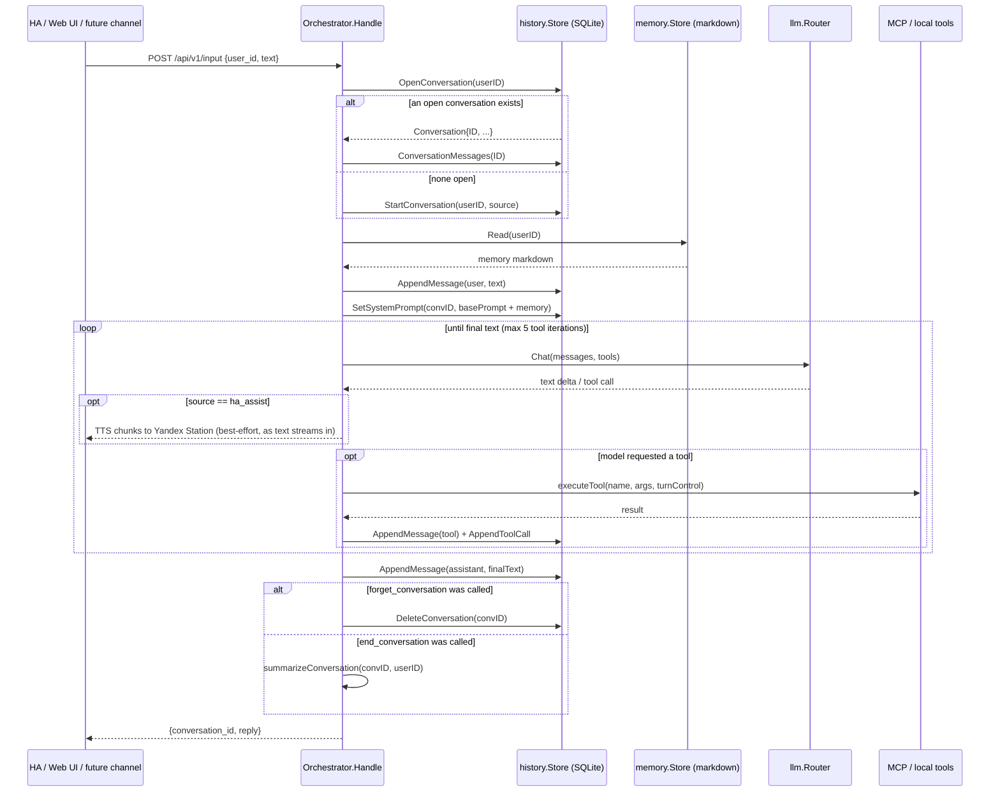
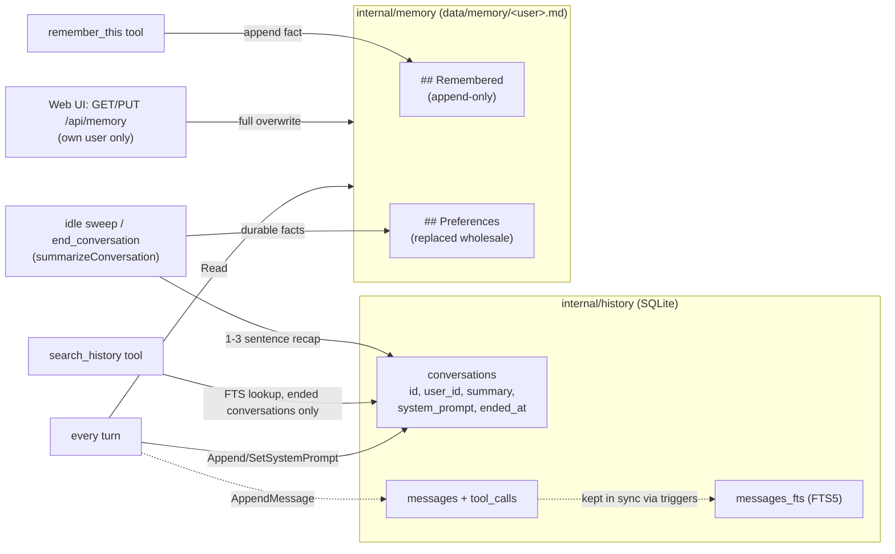

# Miranda — project notes for Claude Code

Miranda is a standalone Go Agent Service — a full personal assistant for
home and family (smart home control, diary/notes/reminders, nutrition
tracking, open-ended tasks, general conversation), not just a Home
Assistant voice add-on — see `README.md` for architecture, build/test
commands, and the HA integration.

## Environment facts to account for when checking documentation

- **Home Assistant version: 2026.7.2.** Always check API/integration
  documentation and behavior against this version specifically — HA's
  conversation entity platform, MCP Server integration, and other APIs
  referenced here evolve quickly between versions.
- **Yandex Station integration**: we use
  [AlexxIT/YandexStation](https://github.com/AlexxIT/YandexStation) as the
  HA custom_component that exposes Yandex Stations as `media_player`
  entities. Miranda's TTS dispatch (`internal/tts`) targets those entities
  via `media_player.play_media` with `media_content_type: text` (never
  `dialog` — that reopens the station's own mic and conflicts with the
  voice pipeline). When touching TTS/media_player code or docs, check
  behavior against this specific integration, not HA's generic
  `media_player` semantics or other Yandex integrations (`yandex_smart_home`,
  `hass-yandex-music-browser`). The opt-in `gemini_tts` provider plays a
  pre-rendered file back through the same entities instead, via
  `media_player.play_media` with a URL and `media_content_type: music` —
  unlike `media_content_type: text`, this specific combination (and whether
  the station accepts the WAV container `gemini_tts` produces by default,
  vs. the MP3 alternative) is **not yet verified against real hardware** —
  see README's TTS section.

## Conventions

- Write explanatory comments (doc-comments on exported symbols, comments on
  non-obvious logic) — this project intentionally diverges from a
  terse/no-comments default; see repo history for why.
- No Docker, no cgo. Single static Go binary (`CGO_ENABLED=0`), pure-Go
  SQLite (`modernc.org/sqlite`). Keep new dependencies cgo-free.
- Config: every field has a Go-level default in `internal/config.Default()`;
  `config.yaml` only needs to override what differs.

## Architecture: agent loop, sessions, and memory

Two independent stores back everything conversation- and memory-related:

| Aspect | `internal/history` (SQLite) | `internal/memory` (markdown) |
|---|---|---|
| Holds | The raw dialog log: every message, tool call, and a per-conversation recap/system-prompt snapshot | Distilled, durable facts about a user that persist across every conversation |
| Granularity | Per conversation | One file per user (`data/memory/<user_id>.md`) |
| Written by | `AppendMessage`/`AppendToolCall` every turn; `EndConversationWithSummary` when a session closes | `remember_this` tool (append) and the summarization pass (replace `## Preferences`); full overwrite from the web UI editor |
| Read by | `search_history` tool (past, ended conversations only); the web UI's read-only dialog browser (own conversations only) | Every turn, injected into the system prompt |

### Session ownership

Session continuity is **server-owned, keyed only on user identity** — not on
any `conversation_id` a caller sends. `InputRequest.ConversationID` is
accepted for backward-compatible request shape but is never read: the same
user talking through Home Assistant, the web UI, Telegram, or any future
channel (mobile app) always continues the same open conversation, because
`resolveConversation` looks it up via `history.OpenConversation(userID)`
rather than trusting the caller. This is what makes the idle timeout
(`Memory.SessionIdleTimeoutMinutes`, default 25) and the explicit
`end_conversation`/`forget_conversation` tools the *only* things that ever
close a session.

Note the destructive actions (`DeleteConversation`, ending+summarizing) only
run *after* the assistant's reply is recorded — a tool call executed
mid-loop just sets a flag on a `turnControl` struct threaded through
`runAgentLoop`/`executeTool`, so a request never loses the reply it already
generated (and, via TTS, already spoke).

### Response routing

The reply always goes back over the HTTP response to whoever called
`POST /api/v1/input` — that's the only output path for the web UI and any
future channel (mobile app) that calls it directly. Telegram is the one
exception: its webhook handler (`internal/httpapi/telegram.go`) calls
`Orchestrator.Handle` in-process rather than over HTTP, and delivers the
reply back out through the Telegram Bot API instead — see "Telegram
channel" below. `req.Source` is threaded through `Handle` → `runAgentLoop` →
`streamOneTurn` purely to gate one *additional* output: `streamOneTurn`
speaks a turn's streamed text live via `speakChunks` only when
`source == users.SourceHAAssist` ("`ha_assist`", the HA thin conversation
client's fixed source value — see `internal/users`) — that's the one
channel where the model's plain reply text is itself the thing to say out
loud, and HA's own Assist pipeline may *also* speak the same reply via its
own TTS step — both firing for `ha_assist` is expected (see README). Every
other source never has its streamed reply text spoken this way; the only
way those sources reach the Yandex Station is the model explicitly calling
the `speak_reply` tool (`executeTool`) with the exact text to speak as a
real tool argument — not a flag inferred from *which* turn happened to
contain the model's answer (an earlier version of this code guessed that
from `control.speakRequested` and could double-speak when the guess was
wrong; see git history). Every other source otherwise stays silent, or
testing via the web UI's debug box would make it talk unprompted. A fired
scheduled task (`source: users.SourceScheduled`, see "Scheduled tasks"
below) is one more source that gets this same silent treatment — its own
prompt has to call `speak_reply`/`send_telegram`/etc. explicitly for
whatever output it wants, same as Telegram or the web UI.

TTS dispatch is asynchronous: `Dispatcher.Speak` only enqueues text onto a
background `Player` (`internal/tts/player.go`) and returns immediately —
synthesis and the physical speaker's actual playback duration never block
the turn that requested it, unlike the synchronous dispatch this used to be.
A consequence of that: a new `ha_assist` turn always calls `o.tts.Stop`
(clearing anything still queued and issuing `media_player.media_stop`) at
the very start of `Handle`, *before* its own speech has any chance to
enqueue — barge-in, so a fresh voice turn always interrupts whatever a
previous turn's reply is still finishing instead of queuing after it. The
model can trigger the same interruption itself mid-reply via the
`stop_speech` tool.

### Telegram channel

Optional (`config.TelegramConfig.Enabled`, default false — see
`internal/telegram` and `internal/httpapi/telegram.go`). Shape of the whole
path: Telegram POSTs an update to `webhook_path` → `handleTelegramWebhook`
checks the `X-Telegram-Bot-Api-Secret-Token` header against a secret
generated fresh at every process startup (`telegram.RandomSecret`, then
re-registered with Telegram via `setWebhook` — nothing to rotate by hand
for the one process that's meant to own this bot's webhook) →
the sender's `@username` is resolved to a configured
`Username` via `users.Registry.ResolveByTelegramName`. **An unmatched
account is logged as a warning and dropped before `Orchestrator.Handle` is
ever called** — there's no history/memory identity for an unrecognized
Telegram account to act as. A match's chat id is saved into
`telegram.ChatStore` (a small JSON file, `Storage.TelegramChatsPath`) on
every message, since the Bot API gives no way to learn a user's chat id
except from a message they sent — this is also what makes the
`send_telegram` tool's proactive sends work later. The reply is delivered
via `telegram.Client.SendMessage` (the Bot API), not this handler's HTTP
response body, which Telegram never reads.

`TelegramConfig.RegisterWebhook` (default true) is the escape hatch for
that "one process" assumption: a second, non-production instance sharing a
real deployment's `TELEGRAM_BOT_TOKEN`/`PublicBaseURL` (e.g. `go run
./cmd/miranda` locally against otherwise-real config via
`MIRANDA_CONFIG_DIR`, for something unrelated to Telegram) still gets a
working `telegram.Client`/`ChatStore` with this set to `false`, it just
never calls `setWebhook` — set this way, `setupTelegram` (`cmd/miranda`)
can't steal webhook ownership from whichever instance is actually deployed
(see git history for the incident that prompted this — a stray local run
re-registered the real bot's secret and broke inbound delivery until the
real instance restarted).

The `send_telegram` tool (`Orchestrator.SetTelegram`,
`config.TelegramConfig.SendMessageTool`) is the *outbound* half: it lets the
model push a message to any household member's Telegram — the current user
by default, or another one resolved by `users.Registry.ResolveByDisplayName`
matching what the user said (e.g. "Аня") against that user's `FullName`/
`Username`. It fails with a clear error (relayed back to the model, not the
caller) if the target has never messaged the bot, since that's the only way
`ChatStore` ever learns a chat id.

### WebAuthn / passkey login

Optional (`config.WebAuthnConfig.Enabled`, default false — same
no-safe-default reasoning as `telegram`, here for `rp_id`/`rp_origins`).
`internal/webauthn` wraps `github.com/go-webauthn/webauthn`: `Service`
orchestrates registration/login ceremonies, `Store` persists credentials
(and each user's stable, random WebAuthn "user handle") in its own SQLite
file (`Storage.WebAuthnSQLitePath`), `CeremonyStore` holds transient
challenge state between a ceremony's begin/finish calls. `internal/webui`
only ever talks to `Service` — registration from the profile screen
(`POST /api/webauthn/register/{begin,finish}`), and login from `/login`'s
biometric button, which is *discoverable/usernameless*
(`BeginDiscoverableLogin`/`FinishDiscoverableLogin`): the browser's own
platform authenticator resolves which resident credential to use before
Miranda knows who's signing in, so there's no per-account signal available
on the anonymous login page at all (see `Store.LookupByCredentialID`, and
`/login`'s own client-side "remembered last method" heuristic, which exists
for exactly this reason).

`Store.ReconcileFlags` works around a real Android quirk: some Android
platform authenticators (Google Password Manager passkeys) report
`BackupEligible=false` at the exact moment a passkey is registered, then
`BackupEligible=true` on every login afterward once the credential finishes
syncing to the cloud. go-webauthn hard-fails any `BackupEligible` mismatch
against what was stored at registration with no config escape hatch
(`go-webauthn/webauthn#240`); `FinishDiscoverableLogin` resyncs the stored
flags to the assertion's actual value before validation runs instead — the
library maintainer's own documented workaround
(`go-webauthn/webauthn#351`). Separately, `/login`'s biometric button
retries once, automatically, on a failure that lands in under 800ms — a
distinct Android/Chrome quirk (a stale WebAuthn request left pending by an
earlier ceremony makes the *next* `navigator.credentials.get()` reject
instantly, before the OS picker even opens; a second call right after
clears it). Both were found debugging the same real bug report and are
unrelated to each other — see git history for the incident.

### Data encryption (keyring)

Always on — no config toggle, unlike `webauthn`/`telegram` (an earlier
version gated this behind `keyring.enabled`, off by default; that let a
user's first-ever login predate the feature and left them stuck with no
master key until a later password login happened to bootstrap one — see
git history) — per-user encryption for data handed to
external MCP tools, starting with the diary MCP tool
(`github.com/archer-developer/miranda-diary`) but designed to generalize.
`internal/keyring` implements the key-wrapping model 1Password/FileVault/
BitLocker all use: one random 32-byte master key per user, wrapped
independently under every registered WebAuthn passkey's PRF output and/or a
password-derived Argon2id key as a fallback — deliberately **not** the same
bcrypt hash `users.Registry.Authenticate` checks logins against, since an
attacker with disk access must not be able to use that persisted hash to
also unlock encrypted data. The unwrapped key lives only in an in-memory
`keyring.Cache` (no persistence, no auto-lock timer — only explicit logout
or a process restart clears it), reflecting the accepted threat model: disk
access is what this defends against, not a live memory-dump attacker.
`Orchestrator.executeTool` injects the key into a whitelisted, `https://`-only
MCP server's tool-call arguments right before dispatch, on a local
variable only — never mutating the `tc` that `history`/`llmtrace` already
recorded — so the key structurally cannot leak into persisted history or
`llm.log`. See **`docs/adr/encryption.md`** for the full design: the wrap/unwrap
sequencing (including the per-username lock that closes a real bootstrap
race between two unlock methods), the PRF ceremony details (including a
real client-side `ArrayBuffer`/`JSON.stringify` bug this had to fix), the
MCP whitelist/HTTPS gating (`MCPServer.EncryptionKeyPermitted`, checked at
both config-load and startup, held on `Orchestrator` rather than
`mcp.Manager` since it's static config data, not connection state), and
known limitations (no recovery-key mechanism, no change-password hook yet).

### File staging (attachments → external MCP services)

The backend, not the model, moves file bytes it must never ask the model to
relay through its own text context — but unlike the encryption-key
injection above, this is a **pull** model, not a push: Miranda hosts the
file itself and hands the model a URI; whichever tool needs the bytes
fetches them itself over a plain HTTP GET. Optional
(`config.FileUploadConfig.Enabled`, default false).

An earlier version of this pushed bytes to whichever server the model
referenced (backend-side `POST /files`, mirroring the encryption-key
argument-injection pattern). It failed at the first real-world retry: the
model called a *different* tool on the same target server that accepted
raw bytes directly (`miranda-medical-card`'s `medical.upload_file`, `data`
argument) instead of the one the push mechanism intercepted, reproducing
the exact hallucination bug this exists to prevent — nothing short of
removing every raw-bytes-accepting tool closes that gap for good, which is
what the current design does. See **`docs/adr/file-staging-refactor.md`** for
the full incident writeup (both the original bug and this one) and why the
push design was abandoned rather than patched further.

How it actually works: `POST /api/upload` (`internal/httpapi/upload.go`)
stages a file straight into `internal/attachments.Store` — Miranda never
forwards it anywhere — generating its own id via `attachments.NewFileID()`
(mirrors `internal/telegram.RandomSecret`'s pattern: 24 random bytes, hex).
`processAttachments` builds a `fileURI` from it
(`PublicBaseURL + "/files/" + fileID`) and includes it in the prompt for
every attachment, not just binary/PDF ones — an inlined image or text file
still gets a URI too, in case a tool needs the file itself rather than just
what got inlined. The one explicit instruction to the model: never try to
construct or embed a file's bytes in a tool call, always pass this address
instead.

`GET /files/{id}` (`handleFilesServe`) is what any external tool fetches
that address from — deliberately **unauthenticated**, the same design
already used by `internal/tts/httpserve.go`'s `GET /tts-audio/{filename}`
for the identical problem (a LAN device needs to fetch a Miranda-hosted
resource by URL): the id's own randomness plus the store's TTL is the
security boundary, not a token. `config.FileUploadConfig.PublicBaseURL`
mirrors `TTSConfig`'s `gemini_tts.PublicBaseURL` for the same reason —
`cmd/miranda` refuses to start with file upload enabled and no
`public_base_url` set. This route is distinct from the separate,
*authenticated* `GET /api/files/{file_id}` (`handleDownload`) — that one
proxies a file some other backend service produced back out to the user's
own browser, the opposite direction from what this section covers; see
"File download proxy" below.

The upshot for any external MCP server that wants to receive a
Miranda-hosted file: its own upload-shaped tool must take a `fileUri`
argument and fetch it itself, not accept raw bytes as an argument at all —
there is deliberately no tool left for the model to hallucinate content
into. See `docs/adr/file-staging-refactor.md`'s contract section for exactly
what that means for the sandbox's and miranda-medical-card's own tool
schemas (implemented in their own repos, not here).

The web UI's chat/history screens must never show this LLM-facing text
verbatim to a human. `processAttachments` appends one
`<attachment>{json}</attachment>` marker per attachment (fields: filename,
mime_type, size_bytes, uri, note) — `internal/webui/static/js/downloads.js`'s
`extractAttachmentBlocks` (shared by `screens/chat.js` and
`screens/history.js`, mirroring how `extractDownloadBlocks` already shares
`<download>` marker parsing between the same two screens) strips it and
renders a chip instead. Deliberately a structured, boundary-delimited tag
rather than something the client regex-matches out of specific prose: an
earlier version tried exactly that (matching an exact Russian sentence),
and it silently broke — chip disappeared, raw instructional text leaked
into the bubble — the moment that sentence's wording changed elsewhere in
the same diff. The marker's `note` field is still human/model-readable
prose (with the real URI substituted in), but the client never parses it —
only the JSON shape is load-bearing for rendering.

### File download proxy (external MCP services → attachments)

The mirror image of file staging above: some MCP servers hand back a link
to a file they host rather than accept one, and the model must never be
handed a URI it can't actually reach and would relay verbatim (e.g.
`miranda-medical-card`'s `medical.get_document` returning a `fileUri` on
`https://127.0.0.1:8791/...` — an internal address requiring the same
bearer token as `/mcp`, useless to a browser). `GET /api/files/{file_id}`
(`handleDownload`) is the one *authenticated* download route (distinct from
the unauthenticated `GET /files/{id}` above): it proxies a request through
to whichever remote file some `attachments.Record` names via `RemoteURL`
(fetched with `RemoteToken` as bearer auth), rather than a single
hardcoded target — this is what lets one instance proxy several different
backend services' files at once.

There is exactly **one** mechanism that stages such a record, for every
file-exposing MCP server including the sandbox — no server gets a
dedicated code path of its own. A server opts in via
`config.MCPServer.ExposeFiles` (`expose_files: true`); each opted-in
server's `FilesEndpoint()` (the `/mcp` → `/files` URL convention) lands in
that server's `FilesEndpoint` field of `Orchestrator`'s `mcpExtensions` map
(wired via `SetMCPServerExtensions` — see "Tools available to the model"
above for why this is one shared map/setter across all three per-server
opt-ins, not a dedicated one for this feature) — built in `cmd/miranda` from
`config.Config.FileExposingServers`, which fails startup on a malformed
opted-in server's URL but only *logs a warning* (not a hard failure) when
`file_upload.enabled` is true and it resolves to an empty map — a
deployment that only wants the upload direction is a legitimate config, but
a forgotten `expose_files: true` on every server should still be visible
somewhere other than a user reporting a missing download chip.
`executeTool` scans *every* tool call result routed to an opted-in server —
`detectRemoteFileLinks` in `internal/httpapi/agent_loop.go` — for a URL
matching that prefix, regardless of which tool produced it or what shape
the rest of the result takes:

- **JSON results** (e.g. `medical.get_document`'s `{"fileUri": "..."}`) —
  the matched URL's sibling fields in the same JSON object (`title`/
  `filename`/`name`/`size_bytes`/`mime_type`/...) are read for a
  best-effort filename/MIME type/size (`findSiblingObject` +
  `stringSiblingField`/`int64SiblingField`).
- **Plain "key: value" text results** (the sandbox's `download_file`,
  which reports `file_id: ...\nfile_uri: ...\nfilename: ...\n...` rather
  than JSON) — the same metadata is read from matching lines instead
  (`keyValueStringField`/`keyValueInt64Field`), using the identical
  priority-ordered key lists.

Either way, only a URL whose prefix matches an explicitly opted-in server's
own `FilesEndpoint()` is ever treated as a file reference — untrusted
input (a malicious/compromised tool result) must never make Miranda's
backend proxy, with that server's own bearer token attached, to an
arbitrary address. Missing metadata degrades cleanly: the download chip
(`downloadChip` in `downloads.js`) simply omits a size/name it doesn't
have rather than guessing wrong.

This is the reason the sandbox's `download_file` tool needs to return a
full `file_uri` field (not just a bare `file_id`) for its downloads to work
under this design — see `docs/adr/file-staging-refactor.md`'s §6 for the
incident that prompted this whole mechanism and the exact contract each
file-exposing MCP server (sandbox included) is expected to follow.

### Scheduled tasks

Optional (`config.ScheduleConfig.Enabled`, default **true** — unlike
Telegram/WebAuthn this needs no deployment secret/URL, so it's opt-out, not
opt-in). Three tools — `create_scheduled_task`, `list_scheduled_tasks`,
`delete_scheduled_task` — back onto their own SQLite file
(`internal/schedule`, `Storage.ScheduleSQLitePath`), the same
one-file-per-subsystem convention `WebAuthnSQLitePath` established, wired in
via `Orchestrator.SetSchedule` (nil means the tools are never offered, same
pattern as `SetTelegram`/`SetWebTools`). A `schedule.Task` stores a `UserID`,
a free-text `Prompt`, and exactly one of `RunAt` (a one-off `time.Time`) or
`CronExpr` (a 5-field `robfig/cron/v3` standard expression); `internal/schedule`
itself never imports `robfig/cron` or knows what a prompt means — callers
compute `NextRunAt` and pass it in, the store only persists it.

A ticker in `cmd/miranda` (`sweepScheduledTasks`, modeled exactly on
`sweepIdleSessions`) calls `Orchestrator.RunScheduledTasks` once a minute.
For each due task it builds `InputRequest{Source: users.SourceScheduled,
UserID: task.UserID, Text: task.Prompt}` and calls `Handle` — the same entry
point every channel uses — inside a `detachedTurnContext` (the same helper
Telegram's webhook handler uses) so the turn survives past the sweep tick
that triggered it. The scheduler never interprets the prompt itself: at fire
time the model decides what tools to call (`speak_reply`, `send_telegram`,
an HA-facing MCP tool, ...), exactly like a live turn — see "Response
routing" above for why a scheduled turn never gets live TTS the way
`ha_assist` does. After firing, a recurring task (`CronExpr` set) is
rescheduled via `cron.ParseStandard(...).Next(time.Now())`; a one-off task
(`RunAt` set) is deleted outright, the same "nothing left to summarize"
reasoning `forget_conversation` uses. `create_scheduled_task` validates
`run_at`/`schedule` (exactly one required, cron syntax, no past `run_at`) at
tool-call time, not at config load — there's no static cron expression in
config to validate ahead of time, every one is model/user-supplied per task.
`delete_scheduled_task`/`list_scheduled_tasks` are scoped to the calling
`userID` the same IDOR-safe way `internal/webui`'s dialog/memory endpoints
are — `schedule.Store.Delete` returns the same `ErrNotFound` whether an id
doesn't exist or belongs to someone else.

Every firing — success or failure, one-off or recurring — is also recorded
as a `schedule.TaskRun` row (`Store.RecordRun`, table
`scheduled_task_history`, a separate table from `scheduled_tasks`) with
`Status` `StatusSent` or `StatusError` (`err.Error()` from `Handle` when it
failed). This is what keeps a firing auditable after the fact even though
the two branches above otherwise erase all trace of it from
`scheduled_tasks` itself: a one-off task's row is deleted outright, and a
recurring task's row is overwritten in place on every `Reschedule`. There's
no tool exposing this history to the model (only `Store.HistoryForUser`,
queried directly against the DB) — deliberately kept out of the agent loop
for now, same "not every persisted thing needs a tool" reasoning as
`internal/webui`'s dialog browser being read-only.

`RunScheduledTasks` takes a `*slog.Logger` and logs every firing (fired,
rescheduled, or failed, with `task_id`/`user_id`) through it rather than
`o.hub` — unlike `o.hub.Publish(Event{Source: "error", ...})`, which nothing
in the web UI currently subscribes to (`internal/webui/static/js/screens/logs.js`'s
Logs screen only has `app_log`/`llm_log` tabs), a logger call reaches
`logs/miranda.log`, stdout, *and* the `app_log` tab (via
`eventHub.Writer("app_log")`, see `cmd/miranda.setupLogging`) — this is the
only durable trace that the scheduler actually ran, separate from a fired
task's own conversation content (already fully captured in `logs/llm.log`
via the normal `Handle`/`llmtrace` path).

### Session lifecycle

```mermaid
stateDiagram-v2
    [*] --> Open: StartConversation\n(no open conversation for this user)
    Open --> Open: turn arrives, no lifecycle tool called
    Open --> Ended: idle sweep past SessionIdleTimeoutMinutes\nOR end_conversation tool
    Open --> Deleted: forget_conversation tool
    Ended --> [*]: EndConversationWithSummary —\nexcluded from future OpenConversation lookups;\nrecap stored on the row, Preferences memory updated
    Deleted --> [*]: DeleteConversation —\nmessages/tool_calls/FTS entries all removed, no memory write
```

- **Idle timeout**: a 1-minute ticker (`cmd/miranda.sweepIdleSessions`) calls
  `Orchestrator.SummarizeIdleSessions`, which finds conversations idle past
  `Memory.SessionIdleTimeoutMinutes` (default 25) via
  `history.IdleConversations` and closes each one.
- **Explicit end** (`end_conversation` tool — the model calls this when the
  user says something like "давай начнём новую беседу"/"let's start a new
  conversation"): closes the session immediately via the same
  `summarizeConversation` helper the idle sweep uses, instead of waiting.
- **Explicit forget** (`forget_conversation` tool — "забудь этот диалог",
  "давай с начала"): deletes the conversation outright. No summarization, no
  memory write — this is the one path with genuinely no trace left behind.
- Either way, the *next* turn for that user finds no open conversation and
  starts a fresh one via `StartConversation`.

### Memory model

### LLM providers and escalation

`config.LLMConfig.Providers` is an ordered fallback chain
(`internal/llm/router.Router` tries each in list order on a connection
failure) — `type: openai_compat` (any OpenAI Chat Completions-compatible
backend), `type: anthropic` (native Claude, `internal/llm/anthropic`), or
`type: gemini` (native Gemini, `internal/llm/gemini`, on
`google.golang.org/genai`). `LLMConfig.DefaultProvider`, if set, is what's
actually honored as "default" — `router.New` moves it to the front of the
fallback order regardless of `Providers`' own list position (this field
existed before but had no effect until this was wired up; don't assume
list order alone determines the default).

Each provider entry carries its own `Escalation EscalationConfig`
(`enabled`, `tool_name`, `target_provider`, optional `description`) — not a
single global setting — so a chain of providers can each pick their own
hand-off target/tool name, e.g. a cheap default model escalates to a
stronger one, which escalates to Claude for genuinely hard turns, instead
of every hard turn skipping straight to the most expensive model (see
`config/llm.yaml` for a worked 3-tier example). `description` overrides
the escalation tool's default "too complex/ambiguous/high-stakes" wording
(`router.defaultEscalationDescription`) — worth setting when a provider has
a concrete, known-missing capability, e.g. `config/llm.yaml`'s Gemini tiers
name code execution explicitly (neither has a working code-execution tool
against the plain Gemini Developer API — see `internal/llm/gemini` below),
since a generic "too hard" prompt doesn't reliably make the model connect
"I can't run code" to "escalate." `Router` owns building and injecting the *active*
provider's own escalation `ToolDef` right before each `Chat()` call — not
`Orchestrator.availableTools`, which only builds the shared base tool list
common to every provider — which is what lets each hop in a chain see only
its own escalation tool, not every provider's. `Router.Chat` walks the
resulting chain to any depth (a small hop cap exists purely to catch a
misconfigured cycle — two providers escalating to each other — not to
limit a legitimate deep ladder).

`type: gemini` is also where `api_key_envs` matters as a real list: Gemini
free-tier keys have a low per-key quota, so `internal/llm/gemini` rotates
across every resolved key on a quota error (HTTP 429/`RESOURCE_EXHAUSTED`)
**or a 5xx server error**. This is broader than `gemini_tts`'s rotation
(quota-only — see `internal/tts/gemini.go`), because a conversational turn
can't afford to drop the whole turn on a transient upstream failure the
way one TTS chunk request can fail loudly; don't "fix" this back to match
TTS's narrower behavior if you're touching either. `anthropic`/
`openai_compat` providers also accept `api_key_envs` (kept for config-
schema consistency with `gemini`) but only ever use the first entry —
those SDKs take a single credential per client, not a rotation pool.

### Web tools (`internal/tools`, `internal/tavily`)

`web_search`/`web_fetch` are Miranda's own tools for live web access,
backed by the [Tavily](https://tavily.com) API (`internal/tavily`, a
minimal client for its `/search` and `/extract` endpoints) and exposed via
`internal/tools.Tool` — a small `Def()`/`Call()` interface deliberately
decoupled from `Orchestrator` (no dependency on history/memory/TTS/users),
so the same value works from any agent loop, not just this one. Unlike
`AnthropicToolsConfig`/`GeminiToolsConfig` (a specific provider's own
server-executed tools), these run through the Orchestrator's ordinary
custom-tool path — `Orchestrator.SetWebTools` wires in whichever ones
`config.TavilyConfig` enables, `availableTools` advertises them to every
provider identically, and `executeTool` dispatches a call to them before
falling through to the MCP tool manager. `Orchestrator.webTools` is kept as
a slice, not a map, specifically so the list order stays identical turn to
turn — `anthropic.Provider.buildTools` places its prompt-cache breakpoint
on the *last* tool in the list (see `toAnthropicMessages`), and a map's
randomized iteration order would silently defeat that cache on every call.

This is what replaced `gemini_tools.google_search` as this project's way of
giving a cheap/free-tier model live web access: Grounding with Google
Search turned out to have a zero quota on the free-tier Gemini Developer
API — not merely a low one — so every request that touched it failed with
`RESOURCE_EXHAUSTED`, including the first call of the day on an otherwise
fresh key; `internal/llm/gemini`'s key rotation couldn't route around it
since the exhaustion is per-*feature*, not per-key. `config/llm.yaml` now
leaves `gemini_tools.google_search` and `anthropic_tools.web_search`/
`web_fetch` off in favor of `tavily.web_search`/`tavily.web_fetch` — both
of those provider-native options are named the same (`web_search`,
`web_fetch`) as the tools this package defines, so enabling a provider's
native one *and* these together is a real conflict, not just redundancy
(Anthropic specifically requires unique tool names on one request). Each
provider's `escalation.description` in `config/llm.yaml` was updated to say
escalating is not needed just to search the web or read a page, now that
every hop in the chain has these directly — see **Web tools** in
`README.md` for the full config shape.

Three safety nets guard the name-collision risk above instead of leaving it
to be discovered at runtime:
`config.validateNoDuplicateWebTools` (`internal/config/config.go`, called
from `Load`) rejects a config where an `anthropic`-type provider's own
`anthropic_tools.web_search`/`web_fetch` is enabled alongside the matching
`tavily.web_search`/`web_fetch` flag. `httpapi.ReservedToolNames()` lists
every name Miranda's own agent loop can ever advertise (every built-in
constant plus `tools.WebSearchToolName`/`WebFetchToolName`), and
`cmd/miranda.validateEscalationToolNames` checks every provider's
`escalation.tool_name` against it at startup — a collision there would
otherwise have `router.deliver` silently intercept real tool calls as
escalation triggers instead of running them. Both run before any
provider/router construction, failing fast the same way
`validateMCPServerNames` already does for its own analogous collision.
Neither can catch a *third* source of the same name — an MCP server whose
prefixed tool name (`internal/mcp.Manager.Tools`'s `<serverName>_<toolName>`)
happens to match, since that name isn't known until the server is actually
connected — so `availableTools` itself de-duplicates at runtime instead:
built-in/internal tool names are collected first, and any MCP `ToolDef`
sharing one of those names is dropped (logged via the hub) rather than
being sent to the provider twice or silently shadowing the built-in.

### Tools available to the model

Config flags below live on `config.MemoryConfig` unless otherwise noted.

| Tool | Config flag | What it does |
|---|---|---|
| `remember_this` | `ExplicitTool` | Append one durable fact to memory immediately, mid-conversation. |
| `search_history` | `SearchHistoryTool` | Full-text search the user's *ended* conversations; returns each match's stored `Summary` (not raw messages) — this is what answers "помнишь, мы говорили о...". |
| `end_conversation` | `EndConversationTool` | Close the current session right now (idle timeout would eventually do this anyway) — triggered by an explicit "start a new conversation" request. |
| `forget_conversation` | `ForgetConversationTool` | Delete the current conversation entirely, no memory write — triggered by an explicit "forget this / start from scratch" request. |
| `speak_reply` | `config.TTSConfig.SpeakReplyTool` | Takes a `text` argument and dispatches exactly that text to `tts.primary`, even on a source other than `ha_assist` — triggered by an explicit "read/say that aloud" request (see Response routing above). Speech-friendly text the model composes itself, not necessarily identical to its written reply. |
| `stop_speech` | `config.TTSConfig.StopSpeechTool` | Interrupt whatever `tts.primary`/`tts.fallback` is currently speaking or has queued (clears the queue, then `media_player.media_stop`s every configured entity) — triggered by an explicit "stop talking" request. Every `ha_assist` turn also triggers this automatically at turn start (barge-in) — see Response routing above. |
| `send_telegram` | `config.TelegramConfig.SendMessageTool` | Proactively push a message to a household member's Telegram (current user by default, or a named one) — see Telegram channel above. |
| `create_scheduled_task` / `list_scheduled_tasks` / `delete_scheduled_task` | `config.ScheduleConfig.Enabled` | Schedule/list/cancel a free-text prompt to be replayed through the agent loop later, once or on a cron recurrence — see Scheduled tasks above. |
| `web_search` | `config.TavilyConfig.WebSearch.Enabled` | Search the live web via Tavily (`internal/tools`, `internal/tavily`) — offered to every LLM provider identically, not tied to one backend's native tool. See "Web tools" above. |
| `web_fetch` | `config.TavilyConfig.WebFetch.Enabled` | Fetch a specific URL's readable text via Tavily's `/extract` endpoint — same package/reasoning as `web_search`. |
| Escalation tool (name configurable per provider) | `config.LLMProvider.Escalation.Enabled` | Hand a hard turn off to that provider's own configured target; intercepted at the router level, transparent to the Orchestrator. See "LLM providers and escalation" above — each provider in the chain has its own target/tool name, and a chain can be more than one hop deep. |
| MCP tools (e.g. `ha_*`) | `config.MCPConfig.Servers[].Enabled` | Home Assistant and other MCP-exposed device/service actions. |

Not a separate tool, but worth noting alongside the MCP tools row above: a
whitelisted server's calls (`MCPServer.EncryptionKeyAllowed`, see "Data
encryption (keyring)" above) get a real `encryption_key` argument injected
server-side, invisibly to the model — it never appears in what the model
itself generated for that tool call, only on the wire to that one server.
Miranda's own resolved conversation id gets the identical treatment for any
server/tool pair listed in that server's `MCPServer.SessionIDTools` (e.g.
`miranda-medical-card`'s `medical.ask`, which needs to correlate a
follow-up question with the same session on its own side) — injected
server-side under that server's `SessionIDArg()`, unconditionally
overwriting any value the model may have supplied itself, since the model
must never be trusted to invent this id on its own. Unlike
`EncryptionKeyAllowed`'s server-wide grant, this permission is scoped
per-tool: most tools on a given server don't declare a session-id parameter
in their own schema at all, and injecting one anyway is exactly the kind of
schema mismatch `EncryptionKeyArgName` had to be added to work around in
the first place — see `docs/adr/medical-card-session-injection.md` for the full
design. Both mechanisms, plus the file-URI download detection described in
"File download proxy" below, are config-driven per-MCP-server opt-ins of
the same underlying shape, so `httpapi.Orchestrator` bundles all three into
one `MCPServerExtension` per server name (`SetMCPServerExtensions`) rather
than three independent maps/setters — `executeTool` resolves a tool call's
owning server once (`mcp.Manager.ServerAndTool`) and reuses that one lookup
for whichever of the three behaviors apply. File staging (see "File
staging" above) is a different shape of the same underlying goal — keeping
real bytes out of the model's own output — but not an invisible backend
substitution: the model itself passes the `fileURI` it was given verbatim,
and the *target server* fetches the bytes, not Miranda.

**Known issue:** `mcp.Manager.ServerForTool`/`ServerAndTool` (and `Call`)
resolve a prefixed tool name back to its owning server by scanning
configured server names with `strings.HasPrefix` against the
`"<server>_<tool>"` convention `prefixedToolName` builds — this is
ambiguous, not just theoretically: two enabled servers where one name is a
`_`-delimited prefix of the other (e.g. `medical` and `medical_card`) can
resolve a call to the wrong server, and since tool names can themselves
contain underscores, the ambiguity isn't even limited to that case (server
`a` + tool `b_c` and server `a_b` + tool `c` both mint the identical
prefixed name `a_b_c`). `validateMCPServerNames` only rejects exact
duplicate server names, not this. Every consumer of this resolution —
encryption-key injection, session-id injection, file-exposing-server
detection, and `Call`'s own dispatch — inherits the misattribution risk.
Not yet fixed; the intended fix is to stop re-deriving `(server, tool)`
from the string at all and instead have `Manager.Tools()` record the exact
`prefixedName → (server, tool)` pairing at the moment it mints each
prefixed name (it already knows this unambiguously there), with
`ServerForTool`/`ServerAndTool`/`Call` looking that mapping up instead of
re-parsing.

### Web UI surface

- `GET /api/dialogs`, `GET /api/dialogs/{id}` — read-only, always scoped to
  the logged-in user (`currentUser(r).Username`); any `user_id` query param
  is ignored, and fetching another user's conversation id 404s.
- `GET /api/memory`, `PUT /api/memory` — view/edit the logged-in user's
  entire memory file, scoped the same way. This is the one path that can
  overwrite memory wholesale rather than append/replace-a-section — a human
  editing their own memory is expected to see and control the whole
  document.

### Logging

Two size-rotated files under `config.Logging.Dir` (`./logs` by default; see
`internal/config.LoggingConfig`):

- `miranda.log` — a mirror of everything the app logs to stdout
  (`cmd/miranda.setupLogging`).
- `llm.log` — a request/response trace written by `internal/llm/router`
  (`Router.SetTracer`, formatted by `internal/llmtrace`), independent of
  which provider handled the turn. Every single provider call (including
  every hop of an escalation chain, not just one) gets one block: the exact system
  prompt, message history, and tool names sent, and the model's final
  text/tool calls or error — tagged with `conversation=<id>` (threaded
  through `ctx` via `llmtrace.WithConversationID`, set once
  `resolveConversation`/`summarizeConversation` know the conversation id).
  This is the tool for debugging *why* a given prompt didn't produce the
  tool call or reply you expected.
