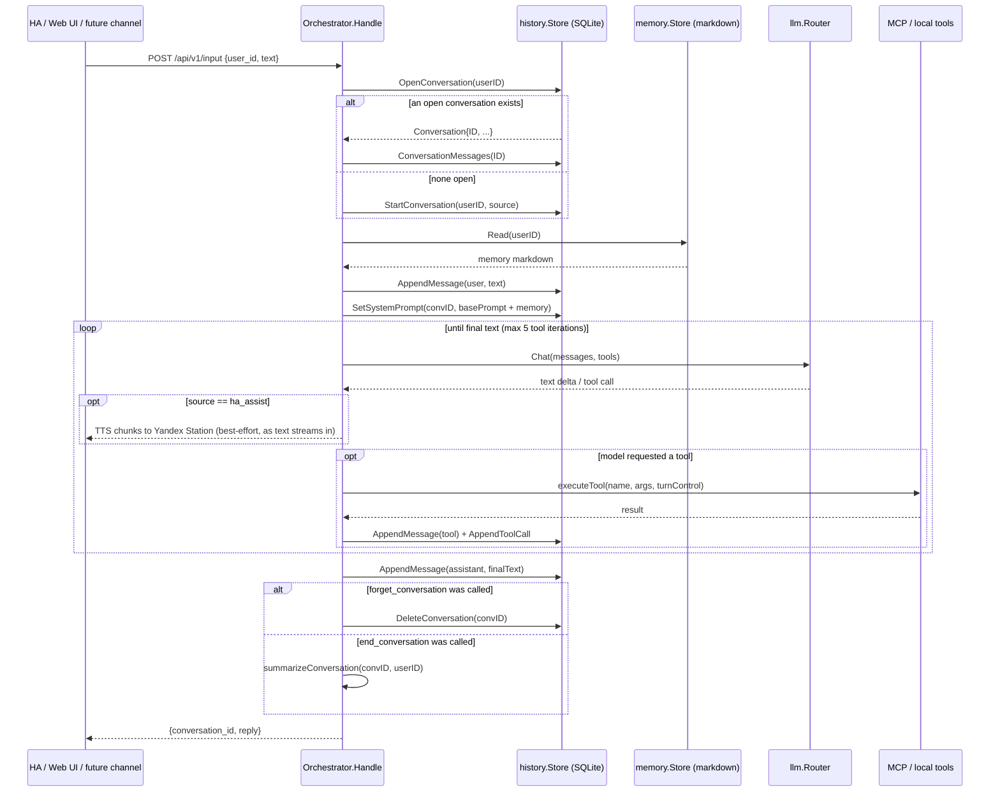
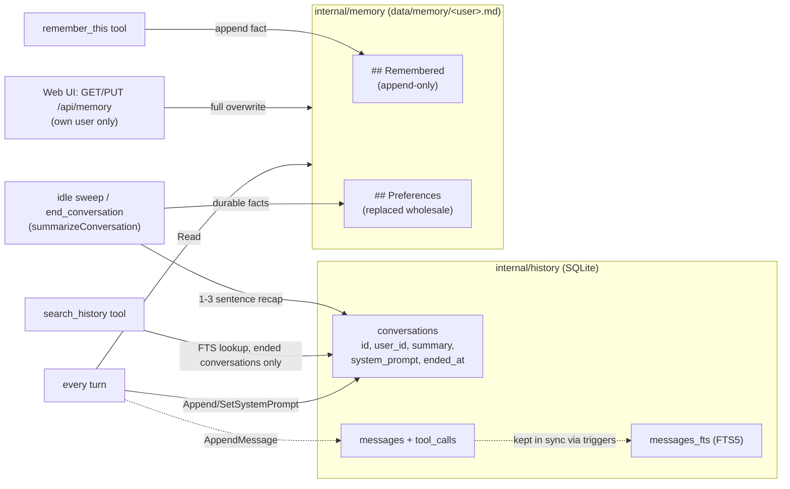

# Miranda — project notes for Claude Code

Miranda is a standalone Go Agent Service (the "brain" behind a home voice
assistant built around Home Assistant) — see `README.md` for architecture,
build/test commands, and the HA integration. `docs/PROJECT_PREREQUISITES.md`
has the original design rationale in Russian.

## Environment facts to account for when checking documentation

- **Home Assistant version: 2026.7.2.** Always check API/integration
  documentation and behavior against this version specifically — HA's
  conversation entity platform, MCP Server integration, and other APIs
  referenced here evolve quickly between versions.
- **Yandex Station integration**: we use
  [AlexxIT/YandexStation](https://github.com/AlexxIT/YandexStation) as the
  HA custom_component that exposes Yandex Stations as `media_player`
  entities. Miranda's TTS dispatch (`internal/tts`) targets those entities
  via `media_player.play_media` with `media_content_type: text` (never
  `dialog` — that reopens the station's own mic and conflicts with the
  voice pipeline). When touching TTS/media_player code or docs, check
  behavior against this specific integration, not HA's generic
  `media_player` semantics or other Yandex integrations (`yandex_smart_home`,
  `hass-yandex-music-browser`). The opt-in `gemini_tts` provider plays a
  pre-rendered file back through the same entities instead, via
  `media_player.play_media` with a URL and `media_content_type: music` —
  unlike `media_content_type: text`, this specific combination (and whether
  the station accepts the WAV container `gemini_tts` produces by default,
  vs. the MP3 alternative) is **not yet verified against real hardware** —
  see README's TTS section.

## Conventions

- Write explanatory comments (doc-comments on exported symbols, comments on
  non-obvious logic) — this project intentionally diverges from a
  terse/no-comments default; see repo history for why.
- No Docker, no cgo. Single static Go binary (`CGO_ENABLED=0`), pure-Go
  SQLite (`modernc.org/sqlite`). Keep new dependencies cgo-free.
- Config: every field has a Go-level default in `internal/config.Default()`;
  `config.yaml` only needs to override what differs.

## Architecture: agent loop, sessions, and memory

Two independent stores back everything conversation- and memory-related:

| Aspect | `internal/history` (SQLite) | `internal/memory` (markdown) |
|---|---|---|
| Holds | The raw dialog log: every message, tool call, and a per-conversation recap/system-prompt snapshot | Distilled, durable facts about a user that persist across every conversation |
| Granularity | Per conversation | One file per user (`data/memory/<user_id>.md`) |
| Written by | `AppendMessage`/`AppendToolCall` every turn; `EndConversationWithSummary` when a session closes | `remember_this` tool (append) and the summarization pass (replace `## Preferences`); full overwrite from the web UI editor |
| Read by | `search_history` tool (past, ended conversations only); the web UI's read-only dialog browser (own conversations only) | Every turn, injected into the system prompt |

### Session ownership

Session continuity is **server-owned, keyed only on user identity** — not on
any `conversation_id` a caller sends. `InputRequest.ConversationID` is
accepted for backward-compatible request shape but is never read: the same
user talking through Home Assistant, the web UI, Telegram, or any future
channel (mobile app) always continues the same open conversation, because
`resolveConversation` looks it up via `history.OpenConversation(userID)`
rather than trusting the caller. This is what makes the idle timeout
(`Memory.SessionIdleTimeoutMinutes`, default 25) and the explicit
`end_conversation`/`forget_conversation` tools the *only* things that ever
close a session.

Note the destructive actions (`DeleteConversation`, ending+summarizing) only
run *after* the assistant's reply is recorded — a tool call executed
mid-loop just sets a flag on a `turnControl` struct threaded through
`runAgentLoop`/`executeTool`, so a request never loses the reply it already
generated (and, via TTS, already spoke).

### Response routing

The reply always goes back over the HTTP response to whoever called
`POST /api/v1/input` — that's the only output path for the web UI and any
future channel (mobile app) that calls it directly. Telegram is the one
exception: its webhook handler (`internal/httpapi/telegram.go`) calls
`Orchestrator.Handle` in-process rather than over HTTP, and delivers the
reply back out through the Telegram Bot API instead — see "Telegram
channel" below. `req.Source` and the current turn's `turnControl` are
threaded through `Handle` → `runAgentLoop` →
`streamOneTurn` → `speakChunks` (`agent_loop.go`) purely to gate one
*additional* output: `speakChunks` only calls `o.tts.Speak` (`tts.primary`,
falling back to `tts.fallback` if the primary's quota is exhausted — see
`internal/tts`) when `source == users.SourceHAAssist` ("`ha_assist`", the HA
thin conversation client's fixed source value — see `internal/users`) or the
`speak_reply` tool was called this turn (`control.speakRequested`).
`ha_assist` firing is deliberate, not incidental: it's the one channel with
a physical speaker to answer through, and HA's own Assist pipeline may
*also* speak the same reply via its own TTS step — both firing for
`ha_assist` is expected (see README). Every other source stays silent
unless the model explicitly calls `speak_reply` because the user asked to
hear the answer — otherwise it must never trigger the shared Yandex
Station, or testing via the web UI's debug box would make it talk
unprompted.

TTS dispatch is asynchronous: `Dispatcher.Speak` only enqueues text onto a
background `Player` (`internal/tts/player.go`) and returns immediately —
synthesis and the physical speaker's actual playback duration never block
the turn that requested it, unlike the synchronous dispatch this used to be.
A consequence of that: a new `ha_assist` turn always calls `o.tts.Stop`
(clearing anything still queued and issuing `media_player.media_stop`) at
the very start of `Handle`, *before* its own speech has any chance to
enqueue — barge-in, so a fresh voice turn always interrupts whatever a
previous turn's reply is still finishing instead of queuing after it. The
model can trigger the same interruption itself mid-reply via the
`stop_speech` tool.

### Telegram channel

Optional (`config.TelegramConfig.Enabled`, default false — see
`internal/telegram` and `internal/httpapi/telegram.go`). Shape of the whole
path: Telegram POSTs an update to `webhook_path` → `handleTelegramWebhook`
checks the `X-Telegram-Bot-Api-Secret-Token` header against a secret
generated fresh at every process startup (`telegram.RandomSecret`, then
re-registered with Telegram via `setWebhook` — nothing to configure or
rotate by hand) → the sender's `@username` is resolved to a configured
`Username` via `users.Registry.ResolveByTelegramName`. **An unmatched
account is logged as a warning and dropped before `Orchestrator.Handle` is
ever called** — there's no history/memory identity for an unrecognized
Telegram account to act as. A match's chat id is saved into
`telegram.ChatStore` (a small JSON file, `Storage.TelegramChatsPath`) on
every message, since the Bot API gives no way to learn a user's chat id
except from a message they sent — this is also what makes the
`send_telegram` tool's proactive sends work later. The reply is delivered
via `telegram.Client.SendMessage` (the Bot API), not this handler's HTTP
response body, which Telegram never reads.

The `send_telegram` tool (`Orchestrator.SetTelegram`,
`config.TelegramConfig.SendMessageTool`) is the *outbound* half: it lets the
model push a message to any household member's Telegram — the current user
by default, or another one resolved by `users.Registry.ResolveByDisplayName`
matching what the user said (e.g. "Аня") against that user's `FullName`/
`Username`. It fails with a clear error (relayed back to the model, not the
caller) if the target has never messaged the bot, since that's the only way
`ChatStore` ever learns a chat id.

### Session lifecycle

```mermaid
stateDiagram-v2
    [*] --> Open: StartConversation\n(no open conversation for this user)
    Open --> Open: turn arrives, no lifecycle tool called
    Open --> Ended: idle sweep past SessionIdleTimeoutMinutes\nOR end_conversation tool
    Open --> Deleted: forget_conversation tool
    Ended --> [*]: EndConversationWithSummary —\nexcluded from future OpenConversation lookups;\nrecap stored on the row, Preferences memory updated
    Deleted --> [*]: DeleteConversation —\nmessages/tool_calls/FTS entries all removed, no memory write
```

- **Idle timeout**: a 1-minute ticker (`cmd/miranda.sweepIdleSessions`) calls
  `Orchestrator.SummarizeIdleSessions`, which finds conversations idle past
  `Memory.SessionIdleTimeoutMinutes` (default 25) via
  `history.IdleConversations` and closes each one.
- **Explicit end** (`end_conversation` tool — the model calls this when the
  user says something like "давай начнём новую беседу"/"let's start a new
  conversation"): closes the session immediately via the same
  `summarizeConversation` helper the idle sweep uses, instead of waiting.
- **Explicit forget** (`forget_conversation` tool — "забудь этот диалог",
  "давай с начала"): deletes the conversation outright. No summarization, no
  memory write — this is the one path with genuinely no trace left behind.
- Either way, the *next* turn for that user finds no open conversation and
  starts a fresh one via `StartConversation`.

### Memory model

### Tools available to the model

Config flags below live on `config.MemoryConfig` unless otherwise noted.

| Tool | Config flag | What it does |
|---|---|---|
| `remember_this` | `ExplicitTool` | Append one durable fact to memory immediately, mid-conversation. |
| `search_history` | `SearchHistoryTool` | Full-text search the user's *ended* conversations; returns each match's stored `Summary` (not raw messages) — this is what answers "помнишь, мы говорили о...". |
| `end_conversation` | `EndConversationTool` | Close the current session right now (idle timeout would eventually do this anyway) — triggered by an explicit "start a new conversation" request. |
| `forget_conversation` | `ForgetConversationTool` | Delete the current conversation entirely, no memory write — triggered by an explicit "forget this / start from scratch" request. |
| `speak_reply` | `config.TTSConfig.SpeakReplyTool` | Dispatch this turn's reply to `tts.primary` even on a source other than `ha_assist` — triggered by an explicit "read/say that aloud" request (see Response routing above). |
| `stop_speech` | `config.TTSConfig.StopSpeechTool` | Interrupt whatever `tts.primary`/`tts.fallback` is currently speaking or has queued (clears the queue, then `media_player.media_stop`s every configured entity) — triggered by an explicit "stop talking" request. Every `ha_assist` turn also triggers this automatically at turn start (barge-in) — see Response routing above. |
| `send_telegram` | `config.TelegramConfig.SendMessageTool` | Proactively push a message to a household member's Telegram (current user by default, or a named one) — see Telegram channel above. |
| `escalate_to_claude` (name configurable) | `config.EscalationConfig.Enabled` | Hand a hard turn to a stronger provider; intercepted at the router level, transparent to the Orchestrator. |
| MCP tools (e.g. `ha_*`) | `config.MCPConfig.Servers[].Enabled` | Home Assistant and other MCP-exposed device/service actions. |

### Web UI surface

- `GET /api/dialogs`, `GET /api/dialogs/{id}` — read-only, always scoped to
  the logged-in user (`currentUser(r).Username`); any `user_id` query param
  is ignored, and fetching another user's conversation id 404s.
- `GET /api/memory`, `PUT /api/memory` — view/edit the logged-in user's
  entire memory file, scoped the same way. This is the one path that can
  overwrite memory wholesale rather than append/replace-a-section — a human
  editing their own memory is expected to see and control the whole
  document.

### Logging

Two size-rotated files under `config.Logging.Dir` (`./logs` by default; see
`internal/config.LoggingConfig`):

- `miranda.log` — a mirror of everything the app logs to stdout
  (`cmd/miranda.setupLogging`).
- `llm.log` — a request/response trace written by `internal/llm/router`
  (`Router.SetTracer`, formatted by `internal/llmtrace`), independent of
  which provider handled the turn. Every single provider call (including
  both legs of an escalation handoff) gets one block: the exact system
  prompt, message history, and tool names sent, and the model's final
  text/tool calls or error — tagged with `conversation=<id>` (threaded
  through `ctx` via `llmtrace.WithConversationID`, set once
  `resolveConversation`/`summarizeConversation` know the conversation id).
  This is the tool for debugging *why* a given prompt didn't produce the
  tool call or reply you expected.
