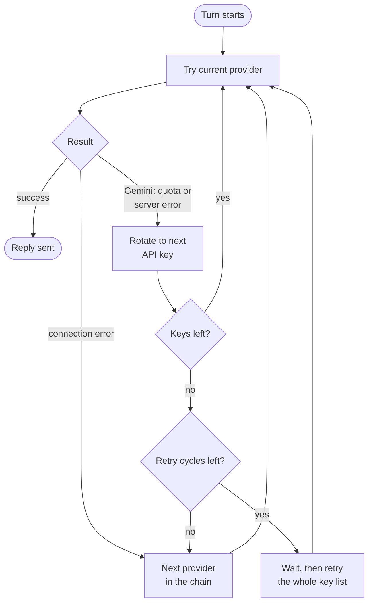
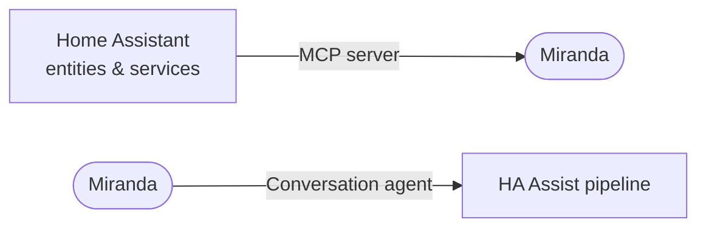
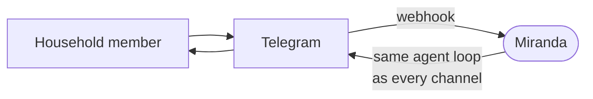
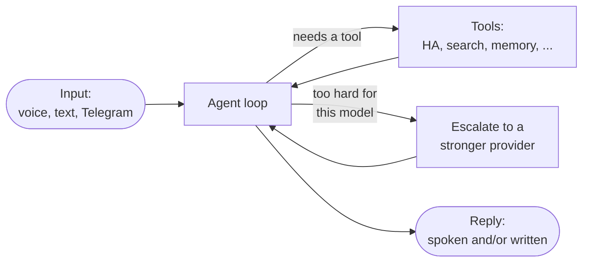

# Miranda

**A full personal assistant for your home and family — not just a Home Assistant voice add-on.**

Miranda controls your smart home (Home Assistant, noolite), keeps a
personal diary, notes, and reminders, tracks nutrition (YAZIO), tackles
open-ended tasks — including real data analysis — and just talks, about
anything, not only the house. One static Go binary, no Docker, no cgo.

```
   Talk to Miranda          Miranda          Pluggable via MCP

  HA voice (STT) ----> +--------------------+ <---- Home Assistant
Desktop / Web UI ----> |     agent loop     | <---- Code sandbox
     Phone (PWA) ----> |  memory + history  | <---- Personal diary
        Telegram ----> |     scheduler      | <---- YAZIO nutrition
                       |    built-in TTS    |
                       +--------------------+
                                   |
                                   v
                             Yandex Station
```

> 📖 This README is for people setting up and running Miranda. If you're an
> AI coding agent (or a human) working on Miranda's internals, read
> `CLAUDE.md` instead.

## Features at a glance

| | |
|---|---|
| 🧠 **Any LLM** | Claude, Gemini, or anything OpenAI-compatible (Ollama, vLLM, OpenRouter, ...) — with automatic fallback and escalation |
| 🏠 **Home Assistant** | Talks over HA's Voice Assist pipeline, and controls HA entities as a tool |
| 🔊 **Yandex Station** | Speaks replies out loud — built-in voice or a Gemini-rendered one |
| 💬 **Telegram** | Household members can chat with it from their phone |
| 🌐 **Web dashboard** | Live logs, dialog history, passwordless login |
| 🔍 **Web search** | Looks things up online when it doesn't know |
| ⏰ **Scheduler** | One-off reminders and recurring routines, in plain language |
| 🧩 **MCP tools** | Anything exposed over MCP — Home Assistant and beyond |
| 🧾 **Memory** | Remembers facts and past conversations per person |

## Contents

- [Getting started](#getting-started)
- [Configuration](#configuration)
  - [LLM routing, escalation, and key rotation](#llm-routing-escalation-and-key-rotation)
  - [MCP servers](#mcp-servers)
- [Web tools](#web-tools)
- [TTS](#tts)
- [Logging](#logging)
- [Web UI](#web-ui)
  - [Login](#login)
  - [Passkey (WebAuthn) login](#passkey-webauthn-login)
  - [Data encryption](#data-encryption)
  - [Language](#language)
- [Home Assistant integration](#home-assistant-integration)
  - [Home Assistant as an MCP server](#home-assistant-as-an-mcp-server)
  - [Miranda as a Home Assistant conversation agent](#miranda-as-a-home-assistant-conversation-agent)
  - [Testing the full loop](#testing-the-full-loop)
  - [Troubleshooting](#troubleshooting)
- [Telegram bot](#telegram-bot)
- [Scheduled tasks](#scheduled-tasks)
- [How it works](#how-it-works)

---

## Getting started

Requires Go 1.25+ (fetched automatically via `GOTOOLCHAIN=auto` if yours is older).

```bash
go build -o miranda ./cmd/miranda   # or: make build
cp config/config.yaml.dist config/config.yaml   # every field documented inline
cp .env.example .env                             # fill in API keys/tokens
./miranda
```

The binary is fully static (`CGO_ENABLED=0`, pure-Go SQLite), so
cross-compiling is a one-liner: `GOOS=linux GOARCH=arm64 go build -o miranda-linux-arm64 ./cmd/miranda`.

Config is assembled from **every `*.yaml` file** in `./config/`, merged
together — not one single file. Split it into `llm.yaml`, `telegram.yaml`,
`mcp.yaml`, etc. if that's tidier, or keep it as one `config.yaml`; both
work identically. Point at a different directory with `MIRANDA_CONFIG_DIR`
to run a second, isolated instance against scratch config without touching
a real deployment:

```bash
MIRANDA_CONFIG_DIR=./config-dev ./miranda
```

> ⚠️ If that scratch config shares a real Telegram bot token/URL with a live
> deployment, also set `telegram.register_webhook: false` in it — otherwise
> its startup hijacks the bot's webhook from whichever instance is actually
> deployed.

### Testing

```bash
make test    # unit tests + a black-box agent-loop integration test
make check   # fmt + lint + test — run before committing
```

### Deploying

```bash
./scripts/deploy.sh
```

Cross-compiles for `linux/amd64`, ships the binary over SSH, and restarts
the `systemd --user` service that runs it. Never touches `config.yaml`,
`data/`, `logs/`, or `.env` on the server.

## Configuration

`config/config.yaml.dist` is the single source of truth for every
setting — every field documented inline, including defaults and the
non-obvious gotchas. Copy it and edit what differs:

```bash
cp config/config.yaml.dist config/config.yaml
```

Secrets (API keys, tokens) never go in the YAML directly — each entry
names an environment variable to read instead (`api_key_envs`,
`token_env`). For local development, put those in `.env` instead of
exporting them by hand every session (a real environment variable always
wins, so this has no effect in production):

```bash
cp .env.example .env
```

### LLM routing, escalation, and key rotation

`llm.providers` is a fallback chain — `type: openai_compat` for any OpenAI
Chat Completions compatible backend, `type: anthropic` for Claude, or
`type: gemini` for native Gemini. `llm.default_provider`, if set, jumps to
the front of that chain regardless of list order.



Separately, each provider can carry its own `escalation` block — the model
itself hands a hard turn off mid-conversation, one hop at a time, seeing
only its own escalation tool at each step:


See `config/llm.yaml` for a worked 3-tier example, including per-hop
`description` overrides that name a specific missing capability (e.g. "you
can't run code, escalate for that") instead of a generic "too complex" default.

### MCP servers

`mcp.servers` is how any [MCP](https://modelcontextprotocol.io) server
becomes a set of tools the model can call — Home Assistant (see below) is
one example among many. A few purpose-built ones pair well with Miranda:

| Server | Adds |
|---|---|
| [miranda-code-execution-sandbox](https://github.com/archer-developer/miranda-code-execution-sandbox) | Sandboxed Python/bash execution, plus the file upload/download the web UI uses |
| [miranda-diary](https://github.com/archer-developer/miranda-diary) | Personal journal entries |
| [miranda-yazio](https://github.com/archer-developer/miranda-yazio) | Nutrition/calorie tracking via YAZIO |

```yaml
mcp:
  servers:
    - name: code_exec_sandbox
      url: "http://127.0.0.1:8788/mcp"
      token_env: "SANDBOX_MCP_TOKEN"
      enabled: true
```

A server that's down at startup never blocks it — Miranda retries in the
background until it comes up, no restart needed.

A server entry can also opt into receiving a user's data-encryption key
(`encryption_key_allowed: true`, requires `https://` — see [Data
encryption](#data-encryption) below).

## Web tools

`web_search`/`web_fetch` give every model live web access via
[Tavily](https://tavily.com), identically no matter which provider handles
the turn — this is what a cheap/free-tier model reaches for instead of a
provider-native search tool with its own separate quota.

```yaml
tavily:
  api_key_env: "TAVILY_API_KEY" # from https://app.tavily.com
  web_search:
    enabled: true
    max_results: 5
  web_fetch:
    enabled: true
```

`web_search` returns titles, URLs, and snippets; `web_fetch` pulls a
specific URL's readable text (typically one from a search result, or one
the user gave directly). Both names are shared with `anthropic_tools`'/
`gemini_tools`' own native equivalents on purpose — don't enable a
provider's native web tool *and* these on the same provider, since a
duplicate tool name is a hard conflict, not just redundancy.

## TTS

| Provider | | |
|---|---|---|
| `yandex_station_text` | default | Yandex Station's built-in voice, zero external dependency |
| `gemini_tts` | opt-in | Renders audio via Gemini and plays it back as a fetched file, for a different voice |

Selected via `tts.primary`, with an optional `tts.fallback` if the primary's
quota is exhausted. Dispatch is always asynchronous — a reply is queued and
the turn continues immediately, never blocking on synthesis or playback. A
new voice turn always interrupts whatever's still speaking; the model can
also stop itself mid-reply via the `stop_speech` tool.

```yaml
tts:
  primary: yandex_station_text
  gemini_tts:
    enabled: false
    api_key_envs: ["GEMINI_API_KEY_1", "GEMINI_API_KEY_2"] # rotates on quota
    public_base_url: "http://192.168.1.50:8787" # where the Station fetches audio from
    audio_format: "wav" # or "mp3" — try mp3 first if replies don't play
```

Every rendered file is cached permanently (content-addressed by model,
voice, format, and text) — a cache hit skips calling Gemini entirely.

## Logging

| File | Contents |
|---|---|
| `logs/miranda.log` | Everything printed to the terminal, mirrored, size-rotated |
| `logs/llm.log` | Every LLM request/response — system prompt, messages, tools, reply or error — tagged `conversation=<id>` |

`llm.log` is the tool for "why didn't the model do what I expected" —
grep one dialog's turns out by its conversation id, across every provider
hop including escalation.

## Web UI

A monitoring dashboard at `server.http_addr` (`http://localhost:8787` by
default) — live log tail, dialog history, and a debug text box hitting the
same input path Home Assistant uses.

### Login

Signing in is mandatory — no anonymous access, no opt-out. With no `users`
configured, the dashboard is simply unreachable (fail-closed by design).

```yaml
users:
  - username: alex
    password_hash: "$2a$10$..." # go run ./cmd/hashpw <password>
    full_name: "Alex"
    ha_user_id: "" # links this account to HA's speaker recognition — see below
    telegram_name: "" # see Telegram bot
    language: "ru" # ru | be | en
```

```bash
go run ./cmd/hashpw 'your-password'
```

**Username is the canonical identity** — the same memory file and history
rows are used whether someone talks to Miranda by logging into the web UI
or by speaking through HA. `ha_user_id` bridges the two: HA sends its own
speaker-recognition id with every voice turn, and if it matches, Miranda
maps it to that user automatically (an unmatched id is logged so you can
find the right value).

### Passkey (WebAuthn) login

Passwordless sign-in — Face ID, Touch ID, a phone's screen lock, a USB key —
alongside the password form:

```yaml
webauthn:
  enabled: true
  rp_id: "miranda.example.com" # bare hostname, no scheme/port
  rp_display_name: "Miranda"
  rp_origins: ["https://miranda.example.com"]
```

Needs a secure context — HTTPS, or `http://localhost` for local dev — so
these must point at whatever actually terminates TLS in front of Miranda.
**Changing `rp_id` later orphans every registered passkey.**

Register from the web UI's profile screen; the login page then leads with
whichever method (password or passkey) last worked on that browser,
tucking the other one behind a single click.

### Data encryption

Always-on per-user encryption for data handed to external MCP tools —
today the [miranda-diary](https://github.com/archer-developer/miranda-diary)
tool, but not tied to it specifically. Builds on passkey login above: a
random master key is generated once per user and unlocked in memory at
login, via a registered passkey's WebAuthn PRF output and/or your password
as a fallback — never via the same hash your password is checked against.
There's nothing to turn on for the keyring itself; what you do configure is
which MCP servers are allowed to receive the key:

```yaml
mcp:
  servers:
    - name: diary
      url: "https://diary.example.com/mcp" # must be https://
      encryption_key_allowed: true
```

Only a server explicitly marked `encryption_key_allowed: true` *and*
reachable over `https://` ever receives the key, injected invisibly into
that server's own tool calls. See **[`docs/encryption.md`](docs/encryption.md)**
for the full design, threat model, and known limitations (there's no
recovery key — losing every passkey and never having logged in with a
password permanently loses access to anything encrypted this way).

### Language

Russian (default), Belarusian, and English — switch with the header's
RU/BE/EN links, or set a per-user default via `language`. UI chrome only;
what language you can *talk to Miranda in* is unconstrained.

---

## Home Assistant integration

Two **independent** integration points — separate tokens, separate HA
integrations:



### Home Assistant as an MCP server

Gives Miranda's agent loop the ability to call HA services and read entity
state.

1. **Settings → Devices & Services → Add Integration** → **"Model Context
   Protocol Server"**. Exposes an MCP endpoint at
   `http://<ha-host>:8123/api/mcp`.
2. **Settings → Voice Assistants → Expose** — toggle on whatever you want
   Miranda to see. Anything not exposed there is invisible to it.
3. **Create a Long-Lived Access Token**: profile → Security → Long-lived
   access tokens. Consider a dedicated, limited HA user rather than an
   admin's token.
4. Wire it in:
   ```bash
   export HA_MCP_TOKEN="<the long-lived access token>"
   ```
   ```yaml
   mcp:
     servers:
       - name: ha
         url: "http://<ha-host>:8123/api/mcp"
         token_env: "HA_MCP_TOKEN"
         enabled: true
   ```
5. *(Optional)* TTS talks to HA's REST API directly and needs its own
   `HA_BASE_URL`/`HA_TOKEN` — reuse the token above, or mint a separate one.

### Miranda as a Home Assistant conversation agent

A thin custom_component (`ha-integration/miranda`) that forwards Assist
pipeline text to Miranda and speaks its reply back — no LLM logic lives in
HA itself.

**Requires**: Home Assistant 2024.6+, and a Miranda instance reachable from
your HA host.

1. Copy `ha-integration/miranda` into HA's `custom_components/` directory
   and restart HA.
2. **Settings → Devices & Services → Add Integration** → **"Miranda"**.
   Fill in the base URL (and bearer token, if `server.auth_token` is set).
   Validated live against Miranda's `/healthz` before saving.
3. **Settings → Voice Assistants**, set **Conversation agent** to
   **Miranda**. Voice replies are spoken back through both the pipeline's
   own TTS *and* Miranda's Yandex Station channel — every other channel
   (web UI, Telegram) stays silent unless the model explicitly calls
   `speak_reply`.
4. Ships with English, Russian, and Belarusian config-flow translations,
   matched to your HA profile's language automatically.

### Testing the full loop

- **No hardware needed**: Voice Assistants → your pipeline → **"Try"**.
- **Bypass HA entirely**:
  ```bash
  curl -X POST http://<miranda-host>:8787/api/v1/input \
    -H "Content-Type: application/json" \
    -d '{"source":"cli","user_id":"debug","text":"привет"}'
  ```
- Watch the web UI's live log tail while testing either path.

### Troubleshooting

| Symptom | Likely cause |
|---|---|
| Config flow shows "cannot_connect" | Wrong base URL, Miranda not running, or a network path issue. Test `curl http://<host>:8787/healthz` from the HA host. |
| Assist can't reach Miranda | Same as above, or a non-200 reply — a 401 means the bearer token doesn't match `server.auth_token`. |
| An entity is missing from Miranda's tools | Not toggled on under Voice Assistants → Expose. |
| Logs show "mcp: failed to connect, will retry" | Check the MCP Server integration, the URL/port, and that `HA_MCP_TOKEN` is valid. Retries automatically — no restart needed once fixed. |

---

## Telegram bot

Household members can talk to Miranda from Telegram — same agent loop,
same memory, keyed by the same username. Needs HTTPS, so only usable
behind a reverse proxy.



1. **Create the bot**: message [@BotFather](https://t.me/BotFather),
   `/newbot`, follow the prompts.
2. **Set the token**:
   ```bash
   export TELEGRAM_BOT_TOKEN="<the token from BotFather>"
   ```
3. **Configure**:
   ```yaml
   telegram:
     enabled: true
     public_base_url: "https://miranda.example.com" # your reverse proxy
     send_message_tool: true
   ```
4. **Map household members** — one Telegram `@username` per account:
   ```yaml
   users:
     - username: alex
       telegram_name: "@alex_tg"
   ```
   An unmapped account is dropped before it ever reaches the model.
5. **Restart.** The webhook (and its auth secret) is registered with
   Telegram automatically on every startup — nothing to rotate by hand,
   *for the one instance that should own it*. Running a second,
   non-production instance against the same token? Set
   `telegram.register_webhook: false` on it, or its startup steals the
   webhook from the real deployment.
6. **Say something to the bot** — the first message is what teaches
   Miranda that person's chat id, which also unlocks proactive sends.

With `send_message_tool: true`, the model can push a message on its own —
*"отправь мне на телефон список покупок"*, or to a named household member
by their full name or username.

---

## Scheduled tasks

On by default (`schedule.enabled: true`). Three tools —
`create_scheduled_task`, `list_scheduled_tasks`, `delete_scheduled_task` —
let the model set its own reminders and routines in plain language; a
background sweep replays the stored prompt through the ordinary agent loop
when it's due, exactly as if the user had just said it.

- **One-off**: *"сегодня в 22:00 напомни мне выпить тёмного пива — отправь
  на телефон"* → a `run_at` timestamp, and a prompt that calls
  `send_telegram` when it fires.
- **Recurring**: *"каждое утро в 9:01 голосом пожелай доброго утра, получи
  курс моих монет и зачитай голосом"* → a cron `schedule`
  (`1 9 * * *`), decomposed by the model at fire time into `speak_reply` +
  a web-search tool call.

`schedule`/`run_at` are mutually exclusive — exactly one per task. Cron is
the standard 5-field format, evaluated in the server's local time zone. A
fired task is silent by default — it has to explicitly call `speak_reply`/
`send_telegram`/etc. if it wants output somewhere.

---

## How it works



Every channel — HA voice, the web UI, Telegram, scheduled tasks — feeds the
same loop and the same per-person memory. What differs is only how a reply
comes back: `ha_assist` turns are spoken automatically; everything else
stays silent unless the model calls `speak_reply` or `send_telegram`
itself.
