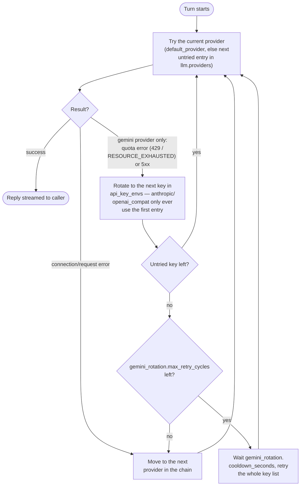
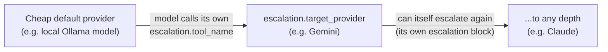

# Miranda

Miranda is the "brain" behind a custom home voice assistant built around
Home Assistant — a standalone Go **Agent Service**, not a custom_component
living inside HA. It compiles to a single self-contained binary (no Docker,
no cgo), routes conversations across multiple LLM providers, keeps dialog
history in embedded SQLite and long-term memory as per-user markdown files,
calls tools over MCP (Home Assistant and others), and speaks replies through
Yandex Station — either its own built-in voice, or (opt-in) a voice rendered
by Gemini's TTS API and played back through the same station. See
`docs/PROJECT_PREREQUISITES.md` for the full design rationale.

```
HA (voice input, MCP tools, TTS output) <---> Miranda Agent Service <---> LLM providers
```

## Contents

- [Building](#building)
- [Testing](#testing)
- [Deploying](#deploying)
- [Configuration](#configuration)
  - [LLM routing, escalation, and key rotation](#llm-routing-escalation-and-key-rotation)
- [Web tools](#web-tools)
- [TTS](#tts)
- [Logging](#logging)
- [Web UI](#web-ui)
  - [Login](#login)
  - [Passkey (WebAuthn) login](#passkey-webauthn-login)
  - [Language](#language)
- [Home Assistant integration](#home-assistant-integration)
  - [Connecting Home Assistant as an MCP server](#connecting-home-assistant-as-an-mcp-server)
  - [Connecting Miranda to Home Assistant (thin conversation client)](#connecting-miranda-to-home-assistant-thin-conversation-client)
  - [Testing the full loop](#testing-the-full-loop)
  - [Troubleshooting](#troubleshooting)
- [Telegram bot](#telegram-bot)
  - [The `send_telegram` tool](#the-send_telegram-tool)
- [Scheduled tasks](#scheduled-tasks)
- [Project layout](#project-layout)

---

## Building

Requires Go 1.25+ (the module pins `go 1.25.0`; with `GOTOOLCHAIN=auto` —
the default — `go build` fetches a matching toolchain automatically if your
installed `go` is older).

```bash
go build -o miranda ./cmd/miranda
# or
make build
```

The binary is fully static (`CGO_ENABLED=0`, pure-Go SQLite driver via
`modernc.org/sqlite`), so cross-compiling for another host is just:

```bash
GOOS=linux GOARCH=arm64 go build -o miranda-linux-arm64 ./cmd/miranda
```

Run it with `make run` (builds then runs), or directly:

```bash
./miranda
```

Config is assembled from every `*.yaml` file in `./config/` (glob'd and
merged — see `internal/config.Load`), not a single file. Point that at a
different directory with `MIRANDA_CONFIG_DIR`, e.g. to run a second,
isolated instance against scratch config without touching the real one:

```bash
MIRANDA_CONFIG_DIR=./config-dev ./miranda
```

If that scratch config still shares a real `TELEGRAM_BOT_TOKEN`/
`public_base_url` with a live deployment (e.g. testing something unrelated
to Telegram against otherwise-real config), also set
`telegram.register_webhook: false` in it — otherwise this instance's
startup will re-register the bot's webhook with a secret only it knows,
breaking inbound delivery to the real deployment until *that* one restarts.
See `TelegramConfig`'s doc comment in `internal/config/config.go`.

## Testing

```bash
make test        # go test ./... -race — unit tests + the black-box agent-loop
                  # integration test in test/integration (fake LLM + fake MCP,
                  # real SQLite/history/memory, real HTTP server)
make lint         # golangci-lint run ./...
make fmt          # gofmt + goimports
make check        # fmt + lint + test — run this before committing
```

`make lint`/`make check` need `golangci-lint` and `goimports` on `PATH` —
`make tools` installs both (plus the Tailwind CLI, see below).

## Deploying

```bash
./scripts/deploy.sh
```

Cross-compiles for `linux/amd64`, ships the binary to the production server
over SSH, and restarts the `systemd --user` service that runs it —
`config.yaml`, `data/`, `logs/`, and `.env` on the server are never touched.
See `.claude/skills/deploy/SKILL.md` for the full breakdown and the
one-time server setup (`loginctl enable-linger`) it depends on.

## Configuration

Copy `config/config.yaml.dist` — the one config file actually committed to
this repo, and the authoritative field-by-field reference (every field
documented inline, including defaults and the non-obvious gotchas — kept
in sync with the code, unlike prose here that can drift) — to
`config/config.yaml` (or split it into several `config/*.yaml` fragments,
one per concern; both work identically, since `internal/config.Load`
merges every `*.yaml` file in the directory — see **Building** above) and
edit it. Secrets (API keys, tokens) are never put in the file directly:
each provider/server entry names one or more environment variables
(`api_key_envs`, `token_env`) to read at startup instead.

```bash
cp config/config.yaml.dist config/config.yaml
```

For local development, those environment variables don't need to be
exported by hand every session: copy `.env.example` to `.env` and fill it
in — Miranda loads it at startup (`internal/envfile`). A variable already
set in the real environment always wins over `.env`, so this has no effect
in production setups (systemd, etc.) that already set secrets some other
way.

```bash
cp .env.example .env
```

### LLM routing, escalation, and key rotation

`llm.providers` is a fallback chain, one entry per model backend
(`type: openai_compat` for any OpenAI Chat Completions compatible server —
Ollama, vLLM, LM Studio, OpenRouter; `type: anthropic` for Claude;
`type: gemini` for native Gemini). `llm.default_provider`, if set, is
moved to the front of that chain regardless of the list's own order.



Separately, each provider entry can carry its own `escalation` block
(`tool_name`, `target_provider`) — not one global setting — so the model
itself can hand a turn it judges too hard off mid-conversation, one hop at
a time, and each hop only sees its own escalation tool:



See `config/llm.yaml` for a worked 3-tier example, including
`description` overrides that name a specific missing capability (e.g. "you
can't run code, escalate for that") instead of a generic "too complex"
default — worth doing wherever a hop has a known gap.

## Web tools

`web_search` and `web_fetch` (`internal/tools`, backed by
`internal/tavily` — the [Tavily](https://tavily.com) API) are Miranda's own
tools for live web access, offered to every LLM provider identically
through the ordinary custom-tool path (`Orchestrator.availableTools`/
`executeTool`, same as `remember_this` or an MCP tool) rather than through
any one provider's own native web tool. This is what replaced Gemini's
`gemini_tools.google_search` as this project's way of giving a cheap/
free-tier model live web access, after Grounding with Google Search turned
out to have a zero quota on the free tier — not merely a low one, so every
request touching it fails with `RESOURCE_EXHAUSTED` regardless of key
rotation (see `config/config.yaml.dist`'s `llm:` comments for the full
story) — a self-hosted implementation sidesteps that per-provider quota
entirely and works the
same way no matter which model in the chain handles the turn, which also
means it's cheaper than paying for Claude's native `anthropic_tools`
equivalents on every escalated turn just to look something up.

Configure under `tavily:` — both default to `false` (opt-in, needs a real
API key):

```yaml
tavily:
  api_key_env: "TAVILY_API_KEY" # from https://app.tavily.com
  web_search:
    enabled: true
    max_results: 5 # bounds how many results are spent into the model's context per search
  web_fetch:
    enabled: true
```

`web_search` calls Tavily's `/search` endpoint and returns each result's
title, URL, and a content snippet; `web_fetch` calls Tavily's `/extract`
endpoint (reusing Tavily rather than Miranda doing its own HTTP GET +
HTML-to-text extraction, so both tools share one dependency, one API key,
and one failure mode) to fetch a specific URL's readable text — typically
one the user gave directly, or one from a prior `web_search` result, since
`web_fetch` alone can't discover a URL itself. Manually verified against
the real Tavily API (a live free-tier key): both endpoints return the
expected result shape end to end.

Both tool names (`web_search`, `web_fetch`) are shared with
`anthropic_tools`'/`gemini_tools`' own native equivalents on purpose — see
`config/config.yaml.dist`'s `llm:` comments — so don't enable a provider's
native web tool alongside these on the same provider: a duplicate tool
name is a hard conflict on Anthropic specifically, not just wasted
redundancy.

## TTS

Two providers, selected via `tts.primary` (and an optional `tts.fallback`
tried if the primary reports its quota exhausted): `yandex_station_text`
(the default — Yandex Station's own built-in voice, no external dependency)
and `gemini_tts` (opt-in — renders audio via Gemini's speech-generation API
and plays it back through the same station as a fetched file, for a
different voice than Yandex's own).

Dispatch is always asynchronous: a reply is enqueued onto a background
player and the turn continues immediately — it never blocks on synthesis or
on the physical speaker's actual playback duration. A new `ha_assist` voice
turn always interrupts (stops) whatever a previous turn's speech is still
finishing, rather than queuing after it, and the model can also stop
speaking mid-reply itself via the `stop_speech` tool (e.g. "хватит", "замолчи").

`gemini_tts` needs:

- One or more Gemini API keys, each in its own environment variable named
  under `tts.gemini_tts.api_key_envs` (see `.env.example`). Listing several
  lets Miranda rotate across them when one hits its quota, retrying the
  whole list again after a cooldown before giving up.
- `tts.gemini_tts.public_base_url` — the URL the Yandex Station can reach
  Miranda through, so it can fetch a rendered file from
  `GET /tts-audio/{key}.{ext}`.
- A choice of `tts.gemini_tts.audio_format`: `"wav"` (default, no extra
  dependency) or `"mp3"`. Whether a real Yandex Station's
  `media_player.play_media` URL playback accepts WAV isn't verified against
  actual hardware yet — the AlexxIT/YandexStation integration's own docs
  only list AAC/FLAC/MP3 for URL playback — so try `"mp3"` first if replies
  don't play.

Every rendered file is cached permanently (content-addressed by model +
voice + format + text, under `storage.tts_cache_dir`, `./data/storage` by
default) — a cache hit skips calling Gemini entirely, which matters more
for quota than chunk size.

## Logging

Everything printed to the terminal is also mirrored to
`logging.dir/miranda.log` (`./logs/miranda.log` by default), rotated by size
so it never grows unbounded (`logging.max_size_mb` / `max_backups` /
`max_age_days`).

Separately, `logging.dir/llm.log` traces every single LLM request and
response: the exact system prompt, message history, and tools sent, plus
the model's reply text/tool calls (or the error, if the call failed) —
this is the tool for figuring out *why* a prompt didn't produce the tool
call or answer you expected. It's written by `internal/llm/router`
regardless of which provider handled the turn (including both legs of an
escalation handoff), and each block is tagged with `conversation=<id>` so
you can grep one dialog's turns out of the file.

## Web UI

Miranda serves a monitoring dashboard at its configured `server.http_addr`
(default `http://localhost:8787`) — live log tail over WebSocket, dialog
history browser, and a debug text input that hits the same unified command
interface HA uses. It's server-rendered Go (`html/template` + vanilla JS,
`internal/webui`), styled with Tailwind CSS v4.

Tailwind is compiled ahead of time by its **standalone CLI** (no Node/npm
needed, not even at build time for the Go binary — the generated
`internal/webui/static/css/styles.css` is committed and embedded via
`go:embed`). Only regenerate it after changing markup in
`internal/webui/templates` or `internal/webui/static`:

```bash
./scripts/download-tailwindcli.sh   # once, installs bin/tailwindcss
make css                             # regenerates styles.css
```

### Login

The web UI requires signing in — there's no anonymous access, and no
opt-out (unlike `server.auth_token`'s bearer-token auth for HA/curl, which
stays open when unset for LAN-only dev use). With no `users` configured, the
dashboard is unreachable by design; that's the fail-closed default, not a
bug to work around.

Add accounts under `users` in `config.yaml`:

```yaml
users:
  - username: alex
    password_hash: "$2a$10$..." # go run ./cmd/hashpw <password>
    full_name: "Alex"
    avatar: "" # https URL, or a filename under storage.avatars_dir
    ha_user_id: "" # see below
    telegram_name: ""
    language: "ru" # ru | be | en, this user's default after login
```

Generate a password hash (plaintext passwords are never stored or logged):

```bash
go run ./cmd/hashpw 'your-password'
```

**Username is the canonical identity for memory/history** — the same
`data/memory/<username>.md` and SQLite rows are used whether a person talks
to Miranda by logging into the web UI or by speaking through HA. The two
channels are reconciled via `ha_user_id`: HA's speaker-recognition system
sends its own (HA-internal) user id with every voice turn, and if it matches
a configured user's `ha_user_id`, Miranda maps it to that user's `username`
before touching history/memory. Find the right value by checking what HA
sends — Miranda logs the raw incoming `user_id` for unmatched HA requests —
or from the HA person/user's own id. A web UI login session always uses its
own username directly; the debug form no longer asks for `user_id` or a
bearer token — your identity comes entirely from being logged in, and the
same-origin session cookie is sent automatically.

### Passkey (WebAuthn) login

Optional passwordless/biometric sign-in (Face ID, Touch ID, a phone's
screen lock, a USB security key) alongside the password form above — off
by default, since (like `telegram`) there's no safe auto-detected
`rp_id`/`rp_origins` for a given deployment:

```yaml
webauthn:
  enabled: true
  rp_id: "miranda.example.com" # bare hostname, no scheme/port
  rp_display_name: "Miranda"
  rp_origins: ["https://miranda.example.com"]
```

WebAuthn only works in a secure browser context — HTTPS, or
`http://localhost` for local dev — so `rp_id`/`rp_origins` must point at
whatever hostname actually terminates TLS in front of Miranda (the same
reverse proxy `telegram` needs), not at `server.http_addr` directly.
**Changing `rp_id` later orphans every already-registered passkey** — pick
the hostname you intend to keep.

Once enabled, each user registers their own passkey from the web UI's
profile screen ("Add passkey on this device") — no config-file step per
user. The login page (`/login`) then offers a biometric button below the
password form; since login is usernameless (the browser's own passkey
picker resolves who's signing in, not a typed username), the page can't
know server-side who's about to sign in, so it falls back to a
browser-local memory of which method (`password` or `passkey`) last
succeeded here, leading with that one and tucking the other behind a
one-click toggle — a wrong guess (e.g. a shared household device) costs
one click, never a dead end.

### Language

The dashboard and login page are available in Russian (default), Belarusian,
and English — switch with the header's RU/BE/EN links (stored in a cookie,
no reload-losing-state JS needed) or set a per-user default via `language`
in their `users` entry. This only affects UI chrome; it has nothing to do
with what language you can talk to Miranda in, which is unconstrained.

---

## Home Assistant integration

There are **two independent integration points** between Miranda and Home
Assistant, covered in the two sections below. They use separate tokens and
separate HA integrations — don't mix them up.

1. **Home Assistant as an MCP server** — gives Miranda's agent loop the
   ability to call HA services and read entity state as tools (turn on
   lights, read sensors, etc).
2. **Miranda as a Home Assistant conversation agent** — a thin
   custom_component (`ha-integration/miranda`) that forwards Assist
   pipeline text to Miranda and speaks its reply back. No LLM logic lives in
   HA; everything (routing, memory, tool calls, TTS chunking) happens in the
   Agent Service.

### Connecting Home Assistant as an MCP server

1. **Settings → Devices & Services → Add Integration**, search for
   **"Model Context Protocol Server"**, and add it. This exposes an MCP
   endpoint at `http://<ha-host>:8123/api/mcp` (Streamable HTTP transport).
2. **Choose what Miranda can control**: the MCP server only exposes entities
   that are **exposed to Assist** — go to **Settings → Voice Assistants →
   Expose** and toggle on whatever you want Miranda to query/control.
   Anything not exposed there is invisible to Miranda's tool calls.
3. **Create a Long-Lived Access Token**: click your profile (bottom-left) →
   **Security** tab → **Long-lived access tokens** → **Create token**. Copy
   it immediately — HA only shows it once. Treat it like a password;
   consider a dedicated, limited HA user for Miranda rather than an admin
   account's token.
4. **Wire the token into Miranda** via an environment variable (never in
   `config.yaml` directly):
   ```bash
   export HA_MCP_TOKEN="<the long-lived access token>"
   ```
   (or, for local development, add `HA_MCP_TOKEN=<token>` to `.env` instead —
   see Configuration above.)
   ```yaml
   # config.yaml
   mcp:
     servers:
       - name: ha
         url: "http://<ha-host>:8123/api/mcp"
         token_env: "HA_MCP_TOKEN"
         enabled: true
   ```
   Restart Miranda. A server that fails to connect never blocks startup —
   it's retried in the background (with backoff) until it comes up, with no
   restart needed once it does. Check Miranda's logs or the web UI's live log
   tail if HA's tools aren't showing up.
5. **(Optional) TTS needs its own HA credentials.** Yandex Station dispatch
   talks to HA's REST API directly (`media_player.play_media`) and needs its
   own token via the `HA_BASE_URL` / `HA_TOKEN` environment variables. You
   can reuse the token from step 3, or create a separate one to revoke
   independently.

### Connecting Miranda to Home Assistant (thin conversation client)

The custom_component lives in `ha-integration/miranda`.

**Prerequisites**: Home Assistant 2024.6+ (needed for the config-entry-based
Conversation entity platform), and a running Miranda instance reachable from
your HA host, e.g. `http://192.168.1.50:8787`.

1. Copy the `ha-integration/miranda` folder into your HA config's
   `custom_components` directory, so you end up with
   `<config>/custom_components/miranda/...` (on Container/Core installs
   that's typically `/config/custom_components/miranda/`).
2. Restart Home Assistant.
3. **Settings → Devices & Services → Add Integration**, search for
   **"Miranda"**. Fill in:
   - **Base URL**: where Miranda is reachable (`server.http_addr` from
     `config.yaml`, with a real host instead of just a port).
   - **Bearer token**: only if `server.auth_token` is set in Miranda's
     `config.yaml`; leave empty for LAN-only dev setups.

   The form validates connectivity against Miranda's `/healthz` endpoint
   before saving.
4. **Settings → Voice Assistants**, open (or create) a pipeline, and set
   **Conversation agent** to **Miranda**. Voice input transcribed by that
   pipeline's STT step is now forwarded to Miranda (`source: ha_assist`);
   its reply is spoken back through that pipeline's TTS step *and*
   dispatched to Miranda's own Yandex Station channel (see **TTS** above) —
   `ha_assist` is the only source that gets the direct TTS dispatch
   automatically, since it's the only channel with a physical speaker to
   answer through, and every new `ha_assist` turn interrupts whatever a
   previous one is still finishing. Every other channel (the web UI, the
   Telegram bot, a future mobile app) only gets its reply back over its own
   connection (the HTTP response) unless the user explicitly asks to hear
   it, via the model's `speak_reply` tool — and any turn can be stopped
   mid-reply via `stop_speech`.
5. The integration ships with English, Russian, and Belarusian translations
   for its config flow; Home Assistant picks the one matching your user
   profile's language automatically.

Reopening the integration's entry (**Configure**) lets you adjust the
per-request timeout (default 30s — the agent loop can call an LLM and
several tools in one turn).

### Testing the full loop

- **No voice hardware needed**: **Settings → Voice Assistants**, open your
  pipeline, use the **"Try"** text box.
- **Bypass HA entirely** (isolates thin-client vs. Miranda issues):
  ```bash
  curl -X POST http://<miranda-host>:8787/api/v1/input \
    -H "Content-Type: application/json" \
    -d '{"source":"cli","user_id":"debug","text":"привет"}'
  ```
- Watch Miranda's web UI for the live log tail while testing either path.

### Troubleshooting

| Symptom | Likely cause |
|---|---|
| Config flow shows "cannot_connect" | Wrong base URL, Miranda not running, or a network path issue between HA and Miranda's host. Test with `curl http://<host>:8787/healthz` from the HA host itself. |
| Assist replies with "Не удалось связаться с Miranda" | Same as above, or Miranda returned a non-200 (check Miranda's logs — a 401 specifically means the bearer token in the integration doesn't match `server.auth_token`). |
| Miranda's tool list from HA is missing an entity | That entity isn't toggled on under **Settings → Voice Assistants → Expose**. |
| Miranda logs "mcp: failed to connect, will retry" for `ha` | Check the MCP Server integration is added in HA, the URL/port in `config.yaml` is correct, and `HA_MCP_TOKEN` is set and valid. Miranda keeps retrying in the background, so `ha`'s tools appear automatically once this is fixed — no restart needed. |

---

## Telegram bot

An optional channel: household members can talk to Miranda from a Telegram
chat, exactly like the web UI or HA voice — same agent loop, same
history/memory, keyed by the same canonical `username`. Off by default
(`telegram.enabled: false`); needs HTTPS, so it's only usable once Miranda
is behind a reverse proxy (the same one `webauthn` needs).

1. **Create the bot**: message [@BotFather](https://t.me/BotFather) on
   Telegram, `/newbot`, follow the prompts. It gives you a bot token —
   treat it like a password.
2. **Set the token** via an environment variable (never in `config.yaml`):
   ```bash
   export TELEGRAM_BOT_TOKEN="<the token from BotFather>"
   ```
   (or add `TELEGRAM_BOT_TOKEN=<token>` to `.env` for local development —
   see Configuration above.)
3. **Configure `config.yaml`**:
   ```yaml
   telegram:
     enabled: true
     webhook_path: "/telegram/webhook"
     public_base_url: "https://miranda.example.com" # your reverse proxy's HTTPS hostname
     send_message_tool: true
   ```
   Make sure your reverse proxy forwards `public_base_url + webhook_path`
   to Miranda's `server.http_addr` — Telegram POSTs updates there directly;
   Miranda does not terminate TLS itself.
4. **Map household members**: set `telegram_name` on each user in
   `users:` to their Telegram `@username` (with or without the leading
   `@`):
   ```yaml
   users:
     - username: alex
       telegram_name: "@alex_tg"
       # ...
   ```
   A message from a Telegram account whose `@username` doesn't match any
   configured `telegram_name` is logged as a warning and dropped — it never
   reaches the agent loop, so an unrecognized account can't rack up LLM
   calls or create a history/memory entry under a raw Telegram username.
5. **Restart Miranda.** On startup it generates a fresh webhook
   authentication secret and registers `public_base_url + webhook_path`
   with Telegram automatically — there's no manual `setWebhook` call to
   make, and nothing else to rotate by hand *for the one process that
   should own this bot's webhook*. Check the logs for `telegram: webhook
   registered` (or an error if Telegram couldn't be reached, which is
   retried on the next restart, not fatal). If you ever run a second,
   non-production instance against this same token/`public_base_url` (see
   **Building** above), set `telegram.register_webhook: false` on that
   instance — otherwise its startup steals the webhook registration from
   whichever instance is actually deployed.
6. **Say something to the bot.** The first message from a mapped user is
   what teaches Miranda that account's chat id (Telegram gives bots no way
   to look this up otherwise) — this is also what makes proactive sends
   possible afterward.

### The `send_telegram` tool

With `telegram.send_message_tool: true`, the model can proactively push a
message to a household member's Telegram — e.g. "отправь мне на телефон
список покупок" (send to whoever is talking right now) or "отправь Ане на
телефон купи молока" (send to a named household member, matched against
that user's `full_name` or `username`). This only works for a user who has
messaged the bot at least once, for the reason in step 6 above.

---

## Scheduled tasks

With `schedule.enabled: true` (the default — see Configuration above), the
model gets three tools: `create_scheduled_task`, `list_scheduled_tasks`, and
`delete_scheduled_task`, backed by their own SQLite file
(`storage.schedule_sqlite_path`, `internal/schedule`). A background sweep
(`cmd/miranda`, once a minute) checks for due tasks and, for each, replays
its stored free-text prompt through the ordinary agent loop
(`Orchestrator.Handle`, `source: "scheduled"`) exactly as if the user had
just said it — Miranda's scheduler never interprets the prompt itself; the
model decides what to do (and which of its own tools — `speak_reply`,
`send_telegram`, an HA-facing MCP tool, etc. — to call) at fire time, the
same as any live turn. A scheduled turn is never spoken live the way
`ha_assist` turns are (see "Response routing" in `CLAUDE.md`) — the prompt
has to explicitly ask for `speak_reply`/`send_telegram`/etc. if it wants
output somewhere.

Two worked examples:

- One-off: *"сегодня в 22:00 напомни мне выпить тёмного пива — отправь на
  телефон"* → `create_scheduled_task` with `run_at` (an RFC3339 datetime)
  and a `task` prompt that itself calls for `send_telegram` when it fires.
- Recurring: *"каждое утро в 9:01 голосом пожелай Ане, мне и Бяше доброго
  утра, получи актуальный курс моих монет и зачитай голосом, а потом
  попроси Алису включить Linkin Park"* → `create_scheduled_task` with
  `schedule` (a standard 5-field cron expression, `1 9 * * *`) and a `task`
  prompt the model decomposes itself at fire time using `speak_reply` (TTS
  already broadcasts to every configured Yandex Station entity, so no
  per-recipient targeting is needed), a web-search/fetch tool for exchange
  rates, and whatever Alice-facing tool is configured.

`schedule`/`run_at` are mutually exclusive — exactly one is required per
task. Cron expressions are the standard `minute hour day-of-month month
day-of-week` 5 fields, evaluated in the server's local time zone.

---

## Project layout

```
cmd/miranda/            entrypoint — wires config, storage, LLM router, MCP, TTS, HTTP server
internal/config/        YAML config + defaults
internal/httpapi/       unified command interface (POST /api/v1/input), the agent loop, /ws/logs
internal/hub/           in-process log/event broadcast for the web UI
internal/llm/           provider-agnostic chat interface
  openaicompat/           client on the official openai-go SDK (any OpenAI-compatible backend)
  anthropic/              client on the official anthropic-sdk-go SDK
  gemini/                 client on the official google.golang.org/genai SDK, multi-key rotation
  router/                 fallback chain + per-provider, chained escalation handoff
internal/mcp/            MCP Client/Manager abstraction, multi-server tool-name prefixing
internal/history/        SQLite (pure-Go, no cgo) dialog log with FTS5 search
internal/memory/         per-user markdown long-term memory
internal/schedule/       SQLite-backed scheduled tasks (one-off + cron recurrence)
internal/tts/            sentence-boundary chunking, Yandex Station text + Gemini TTS providers,
                           disk cache, async player, GET /tts-audio/ handler
internal/ha/             minimal Home Assistant REST client (for TTS dispatch)
internal/telegram/       Telegram Bot API client, webhook types, chat-id store
internal/webui/          Tailwind v4 dashboard, embedded via go:embed
test/integration/        black-box agent-loop test (fake LLM + fake MCP, real everything else)
ha-integration/miranda/  the HA thin conversation client custom_component
docs/                    design docs
```
