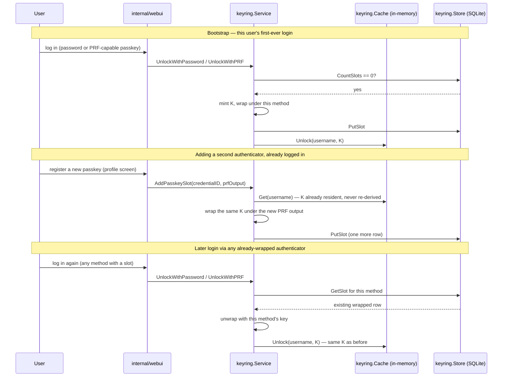

# Data encryption (keyring)

Optional per-user encryption of data Miranda's agent loop hands off to
external tools — today the diary MCP tool
([miranda-diary](https://github.com/archer-developer/miranda-diary)), but
designed to generalize to any future MCP server that wants it. This is the
deep-dive; see `CLAUDE.md`'s "Data encryption (keyring)" section for a short
pointer back here, and `README.md`'s "Data encryption" subsection for the
user-facing config walkthrough.

Always on — no config toggle. Unlike `webauthn.enabled`/`telegram.enabled`
(deliberate opt-in, since those need a deployment-specific secret/URL to be
safe to turn on), the keyring itself needs nothing deployment-specific to
default on safely; what stays opt-in is which MCP servers are trusted to
receive the unwrapped key (`mcp.servers[].encryption_key_allowed`, below).
An earlier version gated the whole feature behind `keyring.enabled` — off
by default — which meant a user's very first login could predate the
feature being turned on, leaving them with no master key until a later
password login happened to bootstrap one. Making it unconditional removes
that edge case entirely: every user gets a key from their first login,
always.

## Threat model

The attack this defends against is **disk access to the server** — an
attacker who reads Miranda's SQLite files, config, or filesystem after the
fact. It does **not** defend against a live attacker with access to the
running process's memory: the unwrapped master key sits in memory for as
long as a user is logged in, and that residency is an explicitly accepted
risk, not something this design tries to eliminate. There is no recovery-key
mechanism — losing every way to unwrap a user's key (below) permanently
loses access to whatever was encrypted under it, by design.

## Key-wrapping model

One random 32-byte master key **K** per user, generated once, matching the
pattern 1Password/FileVault/BitLocker all use: every "authenticator" that
should be able to unlock the data gets its own independently wrapped copy of
K, not K itself.

```
wrapped_1        = AES-256-GCM(PRF_output_credential_1, K)
wrapped_2        = AES-256-GCM(PRF_output_credential_2, K)
wrapped_password = AES-256-GCM(Argon2id(password, salt), K)
```

- **Primary unlock**: a registered WebAuthn passkey's [PRF
  extension](https://www.w3.org/TR/webauthn-3/#prf-extension) output — reuses
  the same passkeys already used for biometric login (`internal/webauthn`).
  PRF's security rests on the authenticator's own private key material, not a
  secret Miranda stores.
- **Fallback unlock**: a KDF (Argon2id) over the user's plaintext password,
  which is only ever available transiently during a login POST and is never
  persisted, in any form, anywhere. Critically, this **must never reuse**
  `users.User.PasswordHash` (the bcrypt hash `internal/users.Registry.Authenticate`
  checks logins against, persisted in config) — if an attacker with disk
  access could use that persisted hash to also unlock encrypted data, the
  whole point of a second factor would be defeated. The Argon2id derivation
  runs independently, with its own freshly-generated salt, over the
  plaintext password itself.

**Critical correctness invariant**: a fresh K is only ever minted when a
user has zero existing slots of any type. Every other unlock path only
tries to unwrap an existing slot of its own type and otherwise no-ops. If
two unlock methods each independently minted a key whenever *their own*
slot was missing, a user could end up with two unrelated master keys
wrapped under different authenticators — data encrypted under one becomes
permanently unreadable via the other. This isn't just a sequencing
convention: `Service.unlockOrBootstrap` (the one place
`UnlockWithPassword`/`UnlockWithPRF` share this branching — see below) holds
a per-username lock across the whole "check for an existing slot, else
count and mint" sequence, so two concurrent unlock attempts for the same
brand-new user (e.g. a password login and a passkey login racing on their
very first login) can never both observe "no slots yet" and each mint an
independent key. `AddPasskeySlot` needs no such lock — it only ever wraps
an *already-unlocked* key (requiring the cache to be warm, `ErrNotUnlocked`
otherwise), so it can't race with the bootstrap path.

### When wrapping happens for each authenticator

Every authenticator a user adds — each WebAuthn credential, plus the one
password slot — gets its own row in `keyring_slots` (below). Wrapping for a
given authenticator happens **once, when that authenticator is added**,
never re-derived later; a later login through the same authenticator only
ever *unwraps* its existing row.



If K isn't unlocked at the moment a user tries to add a new passkey (e.g.
registering a passkey is the very first thing a brand-new user does,
before any password/PRF login has bootstrapped K yet), `AddPasskeySlot`
refuses with `ErrNotUnlocked` rather than minting its own K — this
preserves the single-mint invariant above. The web UI should tell the user
to log in with their password once first in that case.

## `keyring_slots` schema (`internal/keyring/store.go`)

Its own SQLite file, `storage.keyring_sqlite_path` (default
`./data/keyring.db`) — kept separate from every other Miranda database for
the same "wiping/backing up X shouldn't touch Y" reasoning
`webauthn_sqlite_path`/`schedule_sqlite_path` already follow, but this one
deserves *more* care than those: losing this file is data-loss-equivalent to
losing every piece of data encrypted under it, not just an inconvenience.

```sql
CREATE TABLE keyring_slots (
    id          INTEGER PRIMARY KEY AUTOINCREMENT,
    username    TEXT NOT NULL,
    slot_type   TEXT NOT NULL CHECK (slot_type IN ('webauthn','password')),
    slot_ref    TEXT NOT NULL DEFAULT '',   -- base64url credential_id for webauthn slots; '' for the password slot
    wrapped_key BLOB NOT NULL,               -- AES-GCM ciphertext + tag
    nonce       BLOB NOT NULL,               -- 12-byte GCM nonce
    kdf_salt    BLOB,                        -- password slots only
    kdf_params  TEXT,                        -- password slots only, e.g. "argon2id$v=19$m=65536,t=1,p=4"
    created_at  TEXT NOT NULL DEFAULT (...),
    updated_at  TEXT NOT NULL DEFAULT (...)
);
CREATE UNIQUE INDEX idx_keyring_slots_identity ON keyring_slots(username, slot_type, slot_ref);
```

`kdf_params` is a versioned string persisted per row (the same spirit as
bcrypt embedding its own cost into the hash string) — a future Argon2id
tuning change re-derives only *new* password slots differently; existing
rows keep unwrapping correctly using whatever params they were created
with, read back from this column rather than a hardcoded constant.

Every wrap/unwrap binds **AES-GCM associated data (AAD)** to the row's own
identity (`username|slot_type|slot_ref`, see `internal/keyring/crypto.go`'s
`slotAAD`). Without this, an attacker with disk access could copy one row's
`wrapped_key`+`nonce` into a different row's identity and, given a
correctly-derived key for the *target* row, have it decrypt there
undetected; with AAD, `cipher.AEAD.Open` fails loudly (authentication tag
mismatch) on any such splice.

Argon2id parameters (`internal/keyring/crypto.go`): `time=1,
memory=64MiB, parallelism=4, keyLen=32`. Deliberately **not** exposed as a
config knob — this is security-sensitive and easy to misconfigure into
uselessness (e.g. an admin setting `time=0`), with no real per-deployment
reason to differ, unlike genuinely deployment-specific settings like
`webauthn.rp_id`.

## In-memory cache (`internal/keyring/cache.go`)

`Cache` holds every currently-unlocked user's K in a
`sync.RWMutex`-guarded `map[string][]byte`, in-process only — never
persisted, never expired on a timer. Per the threat model above (disk
access, not a live memory-dump attacker), a key staying resident for as
long as a user is logged in — anywhere, since the same K then becomes
usable by HA voice/Telegram/scheduled-task turns for that same username,
not just requests that happen to arrive through the web UI — is an
accepted risk. Only two things ever clear an entry: explicit logout
(`Service.Lock`, called from `internal/webui/auth.go`'s `handleLogout`) or a
process restart. There is deliberately no auto-lock sweep/ticker.

## WebAuthn PRF plumbing (`internal/webauthn`)

The PRF extension's `eval.first` salt is a **fixed, non-secret,
application-specific constant** — SHA-256 of the literal string
`"miranda:master-key:v1"`, base64url-encoded
(`internal/webui/static/js/webauthn.js`'s `PRF_SALT_B64URL`). It doesn't
need to be secret or per-user: PRF's security comes entirely from the
authenticator's private key material, and the salt is pure domain
separation (the same role HKDF's "info" parameter plays) — versioned
(`v1`) so the derivation domain could be rotated later without ambiguity.
It's requested **client-side only**, added directly to
`navigator.credentials.get()`'s options in `prepareRequestOptions`, rather
than round-tripped through `Service.BeginDiscoverableLogin`/`BeginKeyProbe`
as a server-supplied extension option — `protocol.AuthenticationExtensions`
is untyped JSON, and a raw `[]byte` value there would marshal as *standard*
base64, not the base64url this protocol uses for every other byte field;
skipping the round trip sidesteps that encoding mismatch entirely.

**Reading the output back**: the go-webauthn library
(`github.com/go-webauthn/webauthn@v0.17.4`) has no typed PRF support —
`ClientExtensionResults` is an untyped `map[string]any`. `Service` parses
the raw assertion response itself (`protocol.ParseCredentialRequestResponseBytes`,
the same pattern already used for the Android `BackupEligible` flag
reconciliation) and JSON-round-trips the `"prf"` entry into a small typed
struct (`extractPRFOutput`, `internal/webauthn/service.go`). A missing or
malformed PRF result is never an error — it just means this login/probe
didn't produce a usable output, handled as a normal no-op throughout.

**A real client-side bug this had to be fixed, not worked around**: the
PRF extension's `results.first`/`.second` outputs are raw `ArrayBuffer`s.
`JSON.stringify` on an object containing an `ArrayBuffer` silently
serializes it as `{}` (no enumerable own properties) — so
`webauthn.js`'s `credentialToJSON`, which already forwarded
`getClientExtensionResults()` to the server, would have shipped an empty
object even with `prf.eval` correctly requested. Fixed by explicitly
base64url-encoding `results.prf.results.first`/`.second` before
`JSON.stringify`, the same convention every other binary field in that file
already follows.

**Capturing PRF output for a *newly registered* credential**: registration
ceremonies (`navigator.credentials.create()`) don't reliably return PRF eval
results across every browser/authenticator (this varies materially between
platform authenticators and roaming/password-manager-backed ones). The
standard workaround, implemented here, is an immediate follow-up assertion
ceremony scoped to just the new credential:

- `Service.BeginKeyProbe(ctx, username, ceremonyKey, credentialID)` —
  `s.rp.BeginLogin(cu, webauthn.WithAllowedCredentials(...))`, restricting
  the assertion to exactly the credential that was just registered (so the
  browser doesn't prompt for a different passkey).
- `Service.FinishKeyProbe(ctx, username, ceremonyKey, body)` —
  `s.rp.FinishLogin(...)`, then the same `extractPRFOutput` parse.
- Wired into `internal/webui` as `POST /api/webauthn/register/probe-begin`
  / `probe-finish`, called by `webauthn.js`'s `registerPasskey()`
  immediately after `register/finish` succeeds — using the credential ID
  now returned in `CredentialInfo.ID` (base64url of `cred.ID`, a one-line
  fix to `FinishRegistration`'s return value; the credential ID was already
  in scope, just never surfaced before this feature needed it).

This is designed to **fail soft**: a probe failure (no PRF support, or the
ceremony errors) must never be treated as the passkey registration itself
having failed — that already succeeded before the probe ever runs. The
routes themselves are only registered when `webauthn.enabled` is true
(`internal/webui/webui.go`'s `New` — the keyring service it's handed is
never nil outside of tests, so in practice this is the only gate that
matters); if a caller ever does pass a nil `KeyringService`,
`registerPasskey()`'s probe call just gets a 404 and returns `false`, same
as any other soft failure.

## MCP whitelist + HTTPS gating (`internal/mcp`, `internal/config`)

The unwrapped key is only ever sent to MCP servers that are **both**
explicitly whitelisted in config **and** actually connected over
`https://` — a flat per-server flag, so this generalizes to any future
encryption-aware MCP server, not just diary.

```yaml
mcp:
  servers:
    - name: diary
      url: "https://diary.example.com/mcp"
      encryption_key_allowed: true
      encryption_key_arg: record_encryption_key
```

Checked twice, deliberately redundant, both driven by the single shared
predicate `config.MCPServer.EncryptionKeyPermitted()` (`EncryptionKeyAllowed
&& strings.HasPrefix(URL, "https://")`) so the two checks can never drift
apart on what "permitted" means:

1. **Config-load time** (`config.validateEncryptionKeyServers`, called from
   `config.Load` alongside `validateMCPServerNames`):
   rejects `encryption_key_allowed: true` combined with a non-`https://`
   URL outright — fails startup rather than silently degrading.
2. **Startup, before serving traffic** (`cmd/miranda`'s
   `encryptionKeyAllowedServers`): builds a `map[string]string` (server name
   → the tool-call argument name that server's own config entry expects the
   key under, from `EncryptionKeyArg()`) from every configured server whose
   `EncryptionKeyPermitted()` is true, and hands it to
   `Orchestrator.SetEncryptionKeyAllowedServers` — independent of whether a
   server is actually reachable yet, since this is static, config-derived
   data, not anything learned from a live session. This is deliberately
   *not* part of `connectMCP` or `mcp.Manager`: `Manager`'s job is
   connection lifecycle over live/reconnecting clients, and this permission
   bit is neither, so `Orchestrator` holds it directly instead of asking
   the connection manager to remember a static config fact. A mismatch here
   (config says allowed but the scheme check fails) is logged loudly even
   though `validateEncryptionKeyServers` should already have made it
   unreachable — defense in depth, matching this codebase's general "log
   the impossible case anyway" style.

`Orchestrator.encryptionKeyAllowed[name]` and `Manager.ServerForTool(prefixedName)`
(factored out of `Call`'s existing prefix-matching loop, reading only the
server-name order under a read lock rather than the full live-client-map
copy `Call` itself needs) are what `internal/httpapi.executeTool` reads at
dispatch time.

## Injection at dispatch time (`internal/httpapi/agent_loop.go`)

`Orchestrator.SetKeyring(*keyring.Service)` and
`Orchestrator.SetEncryptionKeyAllowedServers(map[string]string)` wire the
feature in, mirroring `SetTelegram`/`SetSchedule`'s post-construction,
config-gated style. Inside `executeTool`, immediately before the MCP call:

```go
callArgs := tc.Arguments
if o.keyring != nil {
    var key []byte
    argName := defaultEncryptionKeyArgName
    if server, ok := o.tools.ServerForTool(tc.Name); ok {
        if a, permitted := o.encryptionKeyAllowed[server]; permitted {
            argName = a
            key, _ = o.keyring.Get(userID) // nil if not currently unlocked
        }
    }
    callArgs, _ = setEncryptionKeyArg(tc.Arguments, argName, key) // nil key strips instead of sets
}
result, err := o.tools.Call(ctx, tc.Name, callArgs)
```

Two behaviors worth calling out explicitly:

- **If the whitelisted tool call fires while the user's key isn't currently
  unlocked** (never logged into the web UI this process lifetime, or
  logged out since — there's no auto-lock timer to expire), the call
  proceeds *without* the key argument rather than blocking the turn; the
  external tool decides what that means (e.g. reject, or store
  unencrypted if it supports that).
- **`setEncryptionKeyArg` always removes the resolved `argName` field the
  model may have set itself when passed a nil key**, which covers every
  non-whitelisted server too (there `argName` falls back to
  `defaultEncryptionKeyArgName`, since no per-server override applies) —
  defense against a compromised or malicious MCP tool description tricking
  the model into forwarding a previously-observed key value to a different,
  non-whitelisted server. The real key is only ever set by this server-side
  injection, never trusted from the model's own generated arguments.

**Why the key can never leak into persisted history or `llm.log`**: `callArgs`
is a fresh local variable — `tc.Arguments` itself is never mutated.
`runAgentLoop` already calls `recordAssistantToolCallMessage` (persisting
the model's original tool call to `history`) and, after `executeTool`
returns, `recordToolCall` (logging the *outer*, unmutated `tc` from the
loop) — both of these run against the same `tc` value that's never touched
by the injection above, since Go passes `tc` into `executeTool` by value.
The messages array fed back to the LLM for the next iteration is built from
that same original `toolCalls` slice, too. So neither `history`'s SQLite
tables nor `internal/llmtrace`'s `llm.log` — nor the model's own context —
ever see the real key value; only the literal bytes sent over the wire to
`o.tools.Call` do.

The injected field name is per-server, not a single global constant: it
comes from `config.MCPServer.EncryptionKeyArg()` (the server's
`encryption_key_arg` override, or `defaultEncryptionKeyArgName =
"encryption_key"` if unset). The external `miranda-diary` repo's tools
actually name this field `record_encryption_key`, so a `diary` server entry
must set `encryption_key_arg: record_encryption_key` explicitly — leaving
it unset silently sends the key under the wrong field name, which that
server's `additionalProperties: false` schema rejects outright on every
call (see the incident this was fixed from: every `diary_add_record` call
failed with `unexpected additional properties ["encryption_key"]` until
this was set). Confirm against that repo directly (or whichever
encryption-aware server you're wiring in) before assuming the default is
correct.

The wire encoding itself (`setEncryptionKeyArg`, `internal/httpapi/agent_loop.go`)
is lowercase hex, 64 characters for a 32-byte key — not configurable per
server, since it's the encoding the one real consumer's
`parseEncryptionKey` requires and there's no evidence yet any future
consumer would want something else. This too was found the hard way: an
earlier version base64-encoded instead, which went unnoticed because
`miranda-diary` ignores `record_encryption_key` entirely (no format check)
for any user whose `encryption` setting is off server-side — the moment a
user's encryption gets turned on there, every call starts failing "must be
64 lowercase hex characters" until the sender switches to hex.

## Config reference

| Field | Default | Notes |
|---|---|---|
| `storage.keyring_sqlite_path` | `./data/keyring.db` | Back up at least as carefully as `storage.sqlite_path`. |
| `mcp.servers[].encryption_key_allowed` | `false` | Requires the same server's `url` to start with `https://`, checked at both config-load and connection time. Still independent of `webauthn.enabled` — a deployment can run passkeys without any server marked `encryption_key_allowed`, or vice versa (though PRF-based unlock obviously needs a registered passkey too). |
| `mcp.servers[].encryption_key_arg` | `"encryption_key"` | The tool-call argument name that server's schema actually expects the key under (always sent lowercase hex-encoded, 64 chars for a 32-byte key). Only meaningful alongside `encryption_key_allowed: true`. The `miranda-diary` repo's tools expect `record_encryption_key`, not the default. |

## Known limitations / open risks

- **A user whose very first authenticated action is a passkey login
  without PRF support** (an older authenticator, or a browser lacking the
  extension) has no way to get a master key until their next *password*
  login — worth a UI hint on the profile/security screen ("log in with
  your password once to enable encryption").
- **No "change password" flow exists anywhere in this codebase today**
  (passwords are set via `config.yaml`'s `password_hash`/`go run
  ./cmd/hashpw`, not a web UI flow). Whoever adds one later must hook it to
  re-wrap K under the new password-derived key (requires the cache to
  already be warm, same constraint `AddPasskeySlot` has) — otherwise a
  password change silently strands the password slot, and if it was the
  user's only slot, permanently loses access to all encrypted data.
- **Losing every slot** (all passkeys removed via
  `handleWebAuthnDeleteCredential` — which does drop the matching keyring
  slot via `RemoveSlotForCredential` — while a password slot was never
  created) is unrecoverable by design. There is no recovery-key slot type
  in scope, consistent with the disk-access-focused threat model above.
